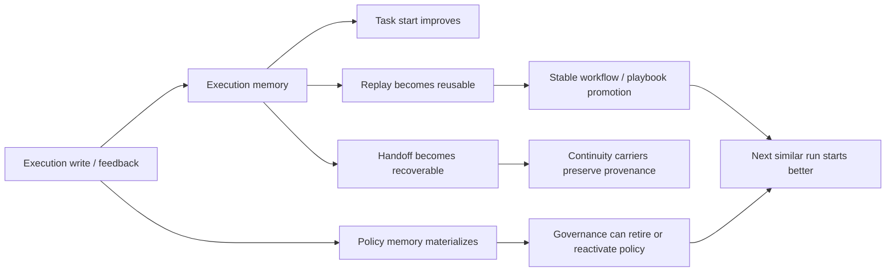
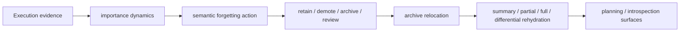
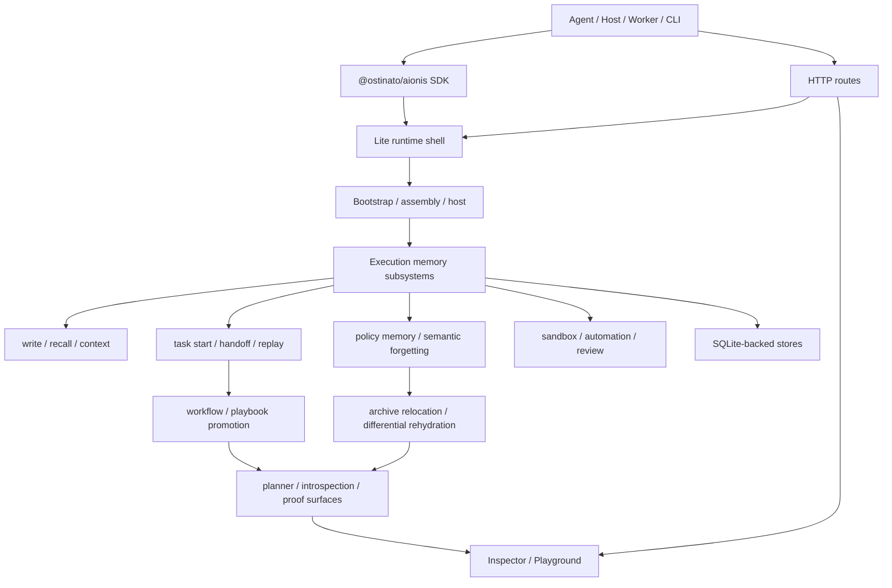

# Aionis Runtime

> Aionis Runtime is the self-evolving continuity execution-memory engine for agent systems.<br>
> It learns from every run to improve task starts, stabilize handoffs, reuse successful workflows, and forget intelligently.

`Lite ships today` · `@ostinato/aionis-runtime` · `@ostinato/aionis` · `6 live proofs`

[Docs Site](https://ostinatocc.github.io/AionisCore/) · [Proof By Evidence](apps/docs/docs/evidence/proof-by-evidence.md) · [SDK Quickstart](docs/SDK_QUICKSTART.md) · [Examples](examples/full-sdk/README.md)

- Status: active technical beta · local-first Lite runtime · public SDK v0.2.0
- Runtime requirements: Node 22+ · SQLite via `node:sqlite` · local macOS or Linux shell recommended
- Security posture: Lite binds to `127.0.0.1` by default; sandbox remote allowlists fail closed.

## Positioning

Aionis Runtime turns `task start`, `handoff`, `replay`, `policy memory`, and `semantic forgetting` into one unified execution-memory loop, so agent systems do not restart from zero every time. They can continue from prior execution, improve over time, and reuse what already worked.

The public product shape today includes:

- `@ostinato/aionis-runtime`: the standalone local-first runtime package
- `Lite`: the local-first runtime shape
- `@ostinato/aionis`: the public TypeScript SDK
- `Inspector / Playground`: runtime observation and demo interfaces
- `Docs Site`: the complete product, mechanism, proof, and reference documentation

## Design Principles

- **Execution first**: the system learns from real execution behavior such as task starts, handoffs, replays, repairs, and governance, not from piling up chat context.
- **Continuity first**: the next start, the next resume, and the next reuse path are exposed as explicit runtime surfaces.
- **Self-evolution first**: every run can feed the next run, producing stronger task starts, more reliable handoffs, better replay, and clearer policy memory.
- **Intelligent forgetting first**: memory is managed by importance, lifecycle, and reuse value through demotion, archive, relocation, and on-demand restoration.
- **Explicit architecture first**: SDKs, HTTP routes, runtime subsystems, SQLite stores, sandbox, and automation are all visible seams instead of one black box.

## Why Aionis Is Different

If you already use LangChain memory, mem0, Letta, Zep, or pgvector-backed recall, the point is not that those tools are useless. The point is that the center of gravity is different. Most memory stacks are optimized to recover context. Aionis is optimized to improve execution.

Execution-first means the primary unit is execution state and runtime outcome: what the agent should do next, what handoff state must survive, what workflows proved reusable, what policy should govern the next run, and what should cool into archive instead of staying hot forever.

| Question | Typical chat/vector memory stack | Aionis Runtime |
| --- | --- | --- |
| What is remembered? | conversations, facts, passages, embeddings | task starts, handoffs, replay runs, workflow promotions, policy memory, forgetting decisions |
| What improves over time? | recall quality | kickoff quality, resume quality, replay reuse, governed policy reuse |
| Core loop | ask → retrieve → answer | start → handoff → replay → govern → forget → start better again |
| Failure control | stale or noisy context | governed demotion, archive relocation, differential rehydration |
| Main question | “What should the model remember?” | “What should the agent do next, and what already worked?” |

That is why Aionis exposes `Task Start`, `Task Handoff`, and `Task Replay` as first-class runtime surfaces instead of treating memory as a sidecar vector store.

## Core Capabilities

| Capability | What it does | Primary surface |
| --- | --- | --- |
| Task Start | Produces a stronger first action for the next similar task | `memory.taskStart(...)`, `memory.planningContext(...)` |
| Task Handoff | Stores structured recovery state across runs, including target files and next action | `handoff.store(...)`, `handoff.recover(...)` |
| Task Replay | Records successful execution, promotes stable workflows, and reuses playbooks | `memory.replay.run.*`, `memory.replay.playbooks.*` |
| Action Retrieval | Exposes the explicit next-action retrieval layer with evidence, source kind, and retrieval surfaces | `memory.actionRetrieval(...)`, `memory.experienceIntelligence(...)` |
| Uncertainty Layer | Turns weak retrieval into explicit gates such as inspect, widen recall, rehydrate payload, or request review | `memory.taskStart(...)`, `memory.planningContext(...)`, `operator_projection.action_hints[]` |
| Policy Memory | Materializes repeated successful execution into governable policy memory | `memory.tools.feedback(...)`, `memory.reviewPacks.evolution(...)` |
| Semantic Forgetting | Moves memory through retain / demote / archive / review and supports differential rehydration | `memory.archive.rehydrate(...)`, `memory.anchors.rehydratePayload(...)` |
| Session / Review / Inspect | Exposes continuity state, evolution state, and review entry points | `memory.sessions.*`, `memory.agent.*`, `memory.executionIntrospect(...)` |
| Sandbox / Automation | Executes local shell, playbook, and automation flows | Lite runtime, sandbox, automation routes |

## Action Retrieval And Uncertainty Layer

Aionis does not stop at remembering prior execution. It exposes an explicit action-retrieval layer that answers the runtime question directly: what should the agent do next, what evidence supports it, and how certain is that recommendation.

That layer now surfaces:

- retrieval evidence entries instead of only a single recommendation
- the selected tool, next action, and recommended file path
- source kind across learned workflow, pattern, policy, and continuity evidence
- uncertainty levels and gate actions such as `inspect_context`, `widen_recall`, `rehydrate_payload`, and `request_operator_review`
- host/operator action hints through `operator_projection.action_hints[]`

This matters because weak retrieval no longer gets flattened into a fake first action. Aionis can escalate task start when the runtime should inspect more context, widen recall, or rehydrate colder payload before acting.

## Self-Evolving Mechanism

Self-evolution in Aionis is not a slogan. It is an explicit runtime loop:



This self-evolving loop is already proven publicly through six live outcomes:

1. the second `task start` gets noticeably better
2. positive feedback materializes `policy memory`
3. `policy memory` can move through `active → retired → active`
4. continuity provenance survives workflow promotion
5. `session continuity` can independently promote stable workflows
6. semantic forgetting cools memory instead of deleting it

You can reproduce all six proofs yourself through the step-by-step [Self-Evolving Demos](apps/docs/docs/evidence/self-evolving-demos.md) guide.

## Forgetting Mechanism

Aionis treats forgetting as a lifecycle mechanism, not as a delete button.



This mechanism already includes:

- `semantic_forgetting_v1`
- `archive_relocation_v1`
- archive rehydrate
- differential payload rehydration
- forgetting summaries in planning and execution introspection

That means memory is managed instead of endlessly accumulated, and restored when needed instead of being discarded blindly.

## Continuity Mechanism

Aionis is organized around three continuity paths:

1. **Start better**
   prior execution improves the kickoff for the next similar task
2. **Resume cleanly**
   handoff packets store the recovery anchor, target files, next action, and resume context
3. **Reuse successful work**
   replay runs feed playbook promotion, repair review, and stable workflow reuse

Continuity is not a side capability in Aionis. It is the organizing axis of the runtime.

## Full Architecture



The architectural point is simple: continuity, self-evolution, forgetting, and governance all live on explicit runtime seams instead of being hidden inside a single opaque system.

## Benchmarks And Validation

The current public validation signals include:

| Metric | Current result | Entry point |
| --- | --- | --- |
| Runnable self-evolving proofs | `6` | [Proof By Evidence](apps/docs/docs/evidence/proof-by-evidence.md) |
| Benchmark scenarios | `15 / 15` | [Validation and Benchmarks](apps/docs/docs/evidence/validation-and-benchmarks.md) |
| Lite runtime test suite | `207 / 207` | `npm run -s lite:test` |
| Public SDK test suite | `14 / 14` | `npm run -s sdk:test` |

The strongest proofs to look at first are:

- better second task start
- persisted policy memory
- governance loop
- continuity provenance preservation
- session continuity promotion
- semantic forgetting with differential rehydration

## Quick Start

### Runtime Requirements

| Item | Requirement |
| --- | --- |
| Node | `22+` |
| Runtime store | SQLite via `node:sqlite` |
| Recommended environment | local macOS or Linux shell |
| Lite default bind | `127.0.0.1` |
| Sandbox posture | remote allowlists fail closed |

### 1. Start Aionis Runtime

```bash
npx @ostinato/aionis-runtime start
```

If you are working from a source checkout instead of the published runtime package:

```bash
npm install
npm run lite:start
```

### 2. Integrate the SDK into your own project

```bash
npm install @ostinato/aionis
```

```ts
import { createAionisClient } from "@ostinato/aionis";

const aionis = createAionisClient({
  baseUrl: "http://127.0.0.1:3001",
});

const taskStart = await aionis.memory.taskStart({
  tenant_id: "default",
  scope: "default",
  query_text: "repair the export route serialization bug",
  context: {
    goal: "repair the export route serialization bug",
  },
  candidates: ["read", "edit", "test"],
});

console.log(taskStart.first_action);
```

### 3. Store a structured handoff

```ts
await aionis.handoff.store({
  tenant_id: "default",
  scope: "demo-sdk-quickstart",
  actor: "sdk-demo",
  anchor: "billing-retry-task",
  summary: "Task paused with a clear next action",
  handoff_text: "Resume in src/billing/retry.ts and rerun timeout checks.",
  target_files: ["src/billing/retry.ts"],
  next_action: "Patch retry timeout handling and rerun the retry checks.",
});
```

### 4. Record a replay-backed run

```ts
await aionis.memory.replay.run.start({
  tenant_id: "default",
  scope: "demo-sdk-quickstart",
  actor: "sdk-demo",
  run_id: "billing-retry-run-1",
  goal: "repair billing retry timeout",
});

await aionis.memory.replay.run.end({
  tenant_id: "default",
  scope: "demo-sdk-quickstart",
  actor: "sdk-demo",
  run_id: "billing-retry-run-1",
  status: "success",
  summary: "patched retry timeout handling",
});
```

### 5. Optional: run the repository proof path

```bash
npm run example:sdk:core-path
```

### 6. Open the local observation interface

```bash
npm run inspector:build
npm run lite:start
```

Then open [http://127.0.0.1:3001/inspector](http://127.0.0.1:3001/inspector).

<!-- BEGIN:CORE_PATH -->

## Default Product Path

| Path | What To Prove | Primary Surfaces |
| --- | --- | --- |
| Core | Continuity works at all | `memory.write(...)`, `memory.taskStart(...)` or `memory.planningContext(...)`, `handoff.store(...)`, `memory.replay.run.*` |
| Enhanced | Continuity improves over time | `memory.archive.rehydrate(...)`, `memory.nodes.activate(...)`, `memory.reviewPacks.*`, `memory.sessions.*` |
| Advanced | The runtime exposes deeper learning and control | `memory.experienceIntelligence(...)`, `memory.executionIntrospect(...)`, `memory.delegationRecords.*`, `memory.tools.*`, `memory.rules.*`, `memory.patterns.*` |

Recommended order:

1. prove the Core path first
2. add the Enhanced path when reuse quality matters
3. move into the Advanced path only when your host needs deeper substrate controls

Fastest repository proof:

```bash
npm run example:sdk:core-path
```

<!-- END:CORE_PATH -->

## Read Next

- [Docs Site](https://ostinatocc.github.io/AionisCore/)
- [Architecture Overview](apps/docs/docs/architecture/overview.md)
- [Proof By Evidence](apps/docs/docs/evidence/proof-by-evidence.md)
- [Self-Evolving Demos](apps/docs/docs/evidence/self-evolving-demos.md)
- [Semantic Forgetting](apps/docs/docs/reference/semantic-forgetting.md)
- [SDK Quickstart](docs/SDK_QUICKSTART.md)
- [Public SDK README](packages/full-sdk/README.md)
- [Bundled SDK Examples](examples/full-sdk/README.md)

## Common Commands

```bash
npm run docs:start
npm run docs:check
npm run -s sdk:test
npm run -s lite:test
npm run -s lite:benchmark:real
```

## Contributing

See [CONTRIBUTING.md](CONTRIBUTING.md). Use Node `22.x`, run `npm run -s lite:test`, and update docs when external behavior changes.

## Releases

Track runtime and package milestones in [GitHub Releases](https://github.com/ostinatocc/AionisCore/releases) and [CHANGELOG.md](CHANGELOG.md).

## License

Apache-2.0 — see [LICENSE](LICENSE).
