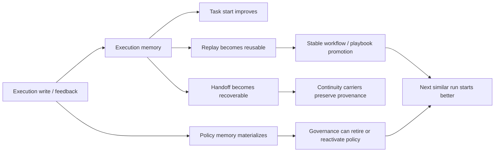
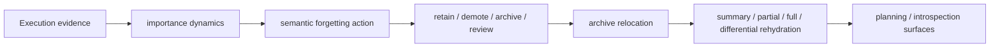
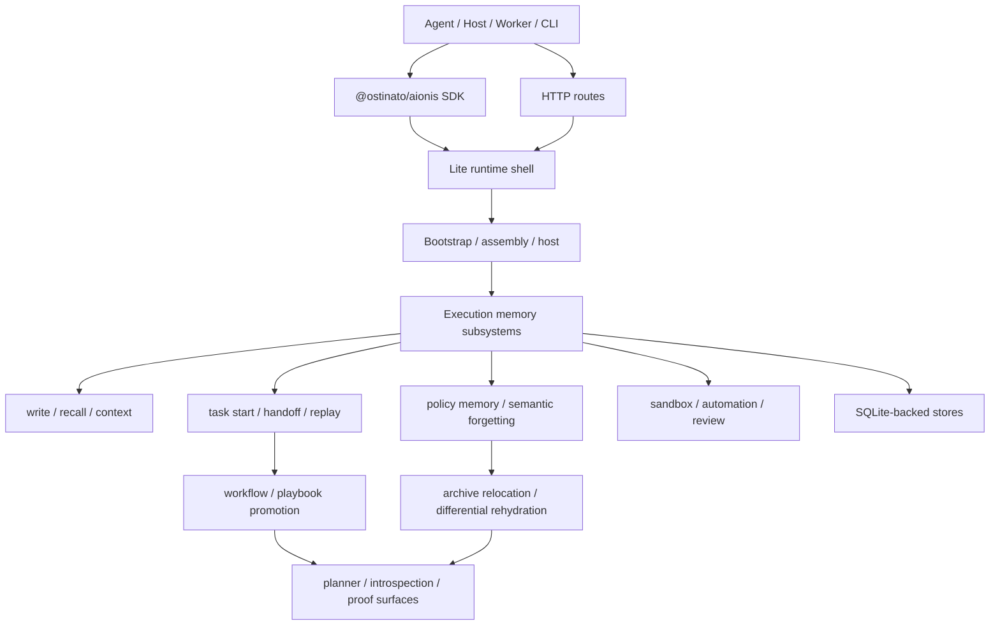

# Aionis Runtime

> Aionis Runtime 是面向 Agent 系统的自进化连续性执行记忆引擎。<br>
> 它从每次执行中学习，让任务启动更准、任务交接更稳、成功流程可重用，并能对记忆进行智能遗忘。

`Lite ships today` · `@ostinato/aionis` · `6 live proofs` · `15 / 15 benchmark scenarios`

[Docs Site](https://ostinatocc.github.io/AionisCore/) · [Proof By Evidence](apps/docs/docs/evidence/proof-by-evidence.md) · [SDK Quickstart](docs/SDK_QUICKSTART.md) · [Examples](examples/full-sdk/README.md)

## 概述定位

Aionis Runtime 把 `task start`、`handoff`、`replay`、`policy memory`、`semantic forgetting` 收成一个统一的执行记忆循环，让 Agent 系统不是每次从零开始，而是能够沿着过去的执行继续学习、继续推进、继续复用。

当前公开交付形态是：

- `Lite`：本地优先的运行时形态
- `@ostinato/aionis`：公开的 TypeScript SDK
- `Inspector / Playground`：面向演示和观察的运行时界面
- `Docs Site`：完整的产品、机制、证据和参考文档

## 设计理念

- **执行优先**：系统学习的对象是任务启动、交接、回放、修复、治理这些真实执行行为，而不是只堆聊天上下文。
- **连续性优先**：把“下一次怎么开始”“中断后怎么恢复”“成功流程怎么复用”做成显式 runtime surface。
- **自进化优先**：每次执行都可以反哺下一次执行，形成更准的 task start、更稳的 handoff、更强的 replay 和更清楚的 policy memory。
- **智能遗忘优先**：记忆不是越堆越多，而是会按重要性、生命周期和重用价值进行降级、归档、迁移与按需恢复。
- **架构显式优先**：SDK、HTTP routes、runtime subsystems、SQLite stores、sandbox、automation 都是清晰命名的边界，不靠黑盒堆起来。

## 核心功能

| 功能 | 作用 | 主要 Surface |
| --- | --- | --- |
| Task Start | 让下一次相似任务获得更强的 first action | `memory.taskStart(...)`, `memory.planningContext(...)` |
| Task Handoff | 用结构化状态跨运行保存恢复点、目标文件和下一步动作 | `handoff.store(...)`, `handoff.recover(...)` |
| Task Replay | 记录成功执行、提升稳定流程、复用 playbook | `memory.replay.run.*`, `memory.replay.playbooks.*` |
| Policy Memory | 把重复成功执行物化成可治理的策略记忆 | `memory.tools.feedback(...)`, `memory.reviewPacks.evolution(...)` |
| Semantic Forgetting | 让记忆按重要性进入 retain / demote / archive / review，并支持 differential rehydration | `memory.archive.rehydrate(...)`, `memory.anchors.rehydratePayload(...)` |
| Session / Review / Inspect | 暴露连续性状态、演化状态和 review 入口 | `memory.sessions.*`, `memory.agent.*`, `memory.executionIntrospect(...)` |
| Sandbox / Automation | 在本地执行 shell / playbook / automation 流程 | Lite runtime, sandbox, automation routes |

## 自进化机制

Aionis 的自进化不是抽象口号，而是显式的运行时循环：



当前这条自进化链已经通过公开 proof 跑通了六个关键结果：

1. 第二次 `task start` 明显更好
2. 正反馈物化出 `policy memory`
3. `policy memory` 可以治理性地 `active → retired → active`
4. continuity provenance 在 workflow promotion 后仍然保留
5. `session continuity` 可以独立推动 stable workflow promotion
6. semantic forgetting 可以冷却记忆而不是直接删除它

## 遗忘机制

Aionis 把遗忘做成 lifecycle 机制，而不是删除按钮。



这套机制当前已经具备：

- `semantic_forgetting_v1`
- `archive_relocation_v1`
- archive rehydrate
- differential payload rehydration
- planning 与 execution introspection 的 forgetting summary

这意味着记忆会被管理，而不是无限堆积；会被恢复，而不是粗暴丢弃。

## 连续性机制

Aionis 的连续性机制围绕三条主线展开：

1. **Start better**
   过去执行会影响下一次同类任务的 kickoff。
2. **Resume cleanly**
   handoff packet 会保存恢复锚点、目标文件、下一步动作和恢复上下文。
3. **Reuse successful work**
   replay run 会进入 playbook promotion、repair review 和稳定流程复用。

连续性在 Aionis 里不是附属能力，而是整套运行时的主轴。

## 完整架构图



架构上的关键点是：Aionis 把连续性、自进化、遗忘、治理这些能力都放在显式 runtime seam 上，而不是隐藏在单一黑盒里。

## Benchmark 与验证数据

当前公开可验证的数据包括：

| 指标 | 当前结果 | 对应入口 |
| --- | --- | --- |
| Runnable self-evolving proofs | `6` 个 | [Proof By Evidence](apps/docs/docs/evidence/proof-by-evidence.md) |
| Benchmark scenarios | `15 / 15` | [Validation and Benchmarks](apps/docs/docs/evidence/validation-and-benchmarks.md) |
| Lite runtime test suite | `194 / 194` | `npm run -s lite:test` |
| Public SDK test suite | `10 / 10` | `npm run -s sdk:test` |

最值得直接看的 proof：

- better second task start
- persisted policy memory
- governance loop
- continuity provenance preservation
- session continuity promotion
- semantic forgetting with differential rehydration

## 快速入门

### 1. 启动 Lite Runtime

```bash
npm install
npm run lite:start
```

### 2. 一键跑通最小连续性路径

```bash
npm run example:sdk:core-path
```

### 3. 在自己的项目里接入 SDK

```bash
npm install @ostinato/aionis
```

```ts
import { createAionisClient } from "@ostinato/aionis";

const aionis = createAionisClient({
  baseUrl: "http://127.0.0.1:3001",
});

const taskStart = await aionis.memory.taskStart({
  tenant_id: "default",
  scope: "default",
  query_text: "repair the export route serialization bug",
  context: {
    goal: "repair the export route serialization bug",
  },
  candidates: ["read", "edit", "test"],
});

console.log(taskStart.first_action);
```

### 4. 打开本地观察界面

```bash
npm run inspector:build
npm run lite:start
```

然后打开 [http://127.0.0.1:3001/inspector](http://127.0.0.1:3001/inspector)。

<!-- BEGIN:CORE_PATH -->

## Default Product Path

| Path | What To Prove | Primary Surfaces |
| --- | --- | --- |
| Core | Continuity works at all | `memory.write(...)`, `memory.taskStart(...)` or `memory.planningContext(...)`, `handoff.store(...)`, `memory.replay.run.*` |
| Enhanced | Continuity improves over time | `memory.archive.rehydrate(...)`, `memory.nodes.activate(...)`, `memory.reviewPacks.*`, `memory.sessions.*` |
| Advanced | The runtime exposes deeper learning and control | `memory.experienceIntelligence(...)`, `memory.executionIntrospect(...)`, `memory.delegationRecords.*`, `memory.tools.*`, `memory.rules.*`, `memory.patterns.*` |

Recommended order:

1. prove the Core path first
2. add the Enhanced path when reuse quality matters
3. move into the Advanced path only when your host needs deeper substrate controls

Fastest repository proof:

```bash
npm run example:sdk:core-path
```

<!-- END:CORE_PATH -->

## 继续阅读

- [Docs Site](https://ostinatocc.github.io/AionisCore/)
- [Architecture Overview](apps/docs/docs/architecture/overview.md)
- [Proof By Evidence](apps/docs/docs/evidence/proof-by-evidence.md)
- [Self-Evolving Demos](apps/docs/docs/evidence/self-evolving-demos.md)
- [Semantic Forgetting](apps/docs/docs/reference/semantic-forgetting.md)
- [SDK Quickstart](docs/SDK_QUICKSTART.md)
- [Public SDK README](packages/full-sdk/README.md)
- [Bundled SDK Examples](examples/full-sdk/README.md)

## 常用命令

```bash
npm run docs:start
npm run docs:check
npm run -s sdk:test
npm run -s lite:test
npm run -s lite:benchmark:real
```
