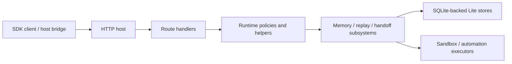

# Architecture overview

The public runtime shape is organized around a thin local runtime shell, a Lite-only assembly path, an HTTP host layer, kernel subsystems, and SQLite-backed local stores.

  Architecture summary
  
Lite is not a monolith and not a fake local wrapper around an implied hosted system. The runtime has explicit seams: shell, bootstrap, assembly, host, kernel subsystems, and local stores.

  

    apps/lite shell
    runtime-entry bootstrap
    runtime-services assembly
    host + route matrix
  

## Repository seams

| Layer | Main paths | Responsibility |
| --- | --- | --- |
| Runtime shell | `apps/lite/` | Launch the Lite local runtime with the right local defaults |
| Bootstrap | `src/index.ts`, `src/runtime-entry.ts` | Start the runtime, register routes, and own bootstrap lifecycle |
| Runtime assembly | `src/app/runtime-services.ts` | Wire Lite stores, replay, sandbox, automation, embeddings, and runtime helpers |
| Host layer | `src/host/*` | Expose supported Lite routes and structured error behavior |
| Kernel subsystems | `src/memory/*` | Implement write, recall, context, handoff, replay, automation, and sandbox logic |
| Storage layer | `src/store/*` | Provide SQLite-backed local persistence for write, recall, replay, automation, and host state |
| SDK layer | `packages/full-sdk/` | Expose the public client surface through `@ostinato/aionis` |

## Startup flow

The Lite startup chain is:

1. `apps/lite/scripts/start-lite-app.sh`
2. `apps/lite/src/index.js`
3. `src/index.ts`
4. `src/runtime-entry.ts`

This keeps the shell thin and makes `src/runtime-entry.ts` the runtime truth for startup and route assembly.

## Request flow at a glance

This is the shape that matters to integrators:

1. the SDK talks to the host through stable routes
2. the host composes runtime helpers and policies
3. the subsystem layer owns behavior
4. the stores own local persistence

## Lite runtime assembly

The main Lite-only wiring lives in `src/app/runtime-services.ts`.

This module assembles:

- Lite host store
- Lite write store
- Lite recall store
- Lite replay store
- Lite automation definition store
- Lite automation run store
- sandbox executor
- local rate limiting, inflight gates, and embedding helpers

It also enforces important Lite constraints such as `AIONIS_EDITION=lite` and local-auth assumptions.

## Host and route layer

The host layer is defined primarily in `src/host/http-host.ts` and `src/host/lite-edition.ts`.

Its job is to:

1. register stable health and runtime routes
2. expose the Lite-supported public surface
3. return structured error envelopes
4. return structured `501` responses for intentionally unsupported full-runtime surfaces

That boundary is one of the design strengths of the project: Lite is explicit about what is public and what remains server-only.

## Lite boundary model

| Category | Inside Lite today | Outside Lite today |
| --- | --- | --- |
| Memory | write, recall, planning, task start, lifecycle routes | broader hosted control-plane memory operations |
| Handoff | store and recover | hosted coordination layers beyond Lite |
| Replay | replay runs, playbooks, governed subset | broader server-only governance surfaces |
| Runtime ops | `/health`, config-driven local boot, structured `501` boundaries | admin control plane |
| Execution | local sandbox and local automation kernel | hosted remote execution plane |

## Kernel subsystems

The largest runtime subsystems live in `src/memory/`:

- `write.ts` for write preparation and application
- `recall.ts` for retrieval and recall execution
- `context.ts` for context assembly
- `handoff.ts` for structured pause and resume
- `replay.ts` for replay lifecycle, playbooks, review, and governed execution
- `sandbox.ts` for local sandbox execution
- `automation-lite.ts` for the local automation kernel

These modules are what make the runtime more than a storage wrapper.

## Storage model

Lite uses multiple SQLite-backed local stores rather than one generic blob store.

Primary stores include:

- `lite-write-store`
- `lite-recall-store`
- `lite-replay-store`
- `lite-automation-store`
- `lite-automation-run-store`
- `lite-host-store`

That split makes the runtime easier to evolve by responsibility rather than hiding everything behind one persistence abstraction.

## Why this architecture matters

This architecture does three important things:

1. it keeps the public runtime honest about its Lite boundary
2. it makes runtime behavior inspectable instead of burying it in prompts
3. it lets continuity live as infrastructure, not as a hidden side effect of one agent product

That is the practical reason Aionis feels different from a thin prompt wrapper or one big monolithic agent app.

## Read deeper when you need to

You can stay inside the docs site for normal product and integration understanding. Only drop to raw repository references when you need exact contract names, route availability, or source-level debugging.

  <a class="doc-card" href="../runtime/lite-runtime.md">
    Runtime surface
    <h3>Lite Runtime</h3>
    
Read what Lite includes today, what it excludes, and why the `501` boundary is a feature.

  </a>
  <a class="doc-card" href="../runtime/lite-config-and-operations.md">
    Operations
    <h3>Lite Config and Operations</h3>
    
See startup chain, default env, SQLite paths, sandbox modes, and operational checks.

  </a>
  <a class="doc-card" href="../reference/contracts-and-routes.md">
    Reference
    <h3>Contracts and Routes</h3>
    
Move from architecture shape into the route and SDK surfaces that expose it.

  </a>

