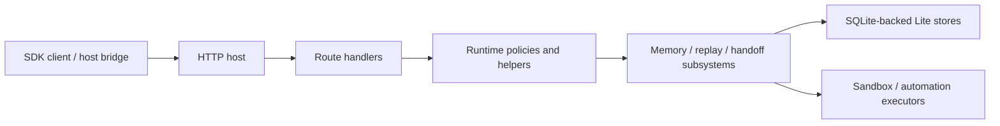

# Architecture overview

The public runtime shape is organized around a thin local runtime shell, a Lite-only assembly path, an HTTP host layer, runtime subsystems, and SQLite-backed local stores.

  Architecture summary
  
Lite is organized around explicit seams: shell, bootstrap, assembly, host, runtime subsystems, and local stores. That structure makes the runtime easier to understand and integrate.

  

    apps/lite shell
    runtime-entry bootstrap
    runtime-services assembly
    host + route matrix
  

  

    Layer 01
    <h3>Runtime shell</h3>
    apps/lite/
    
Boots Lite locally with the intended local-first defaults.

  

  

    Layer 02
    <h3>Bootstrap</h3>
    src/runtime-entry.ts
    
Loads env, assembles runtime services, registers host routes, and owns startup lifecycle.

  

  

    Layer 03
    <h3>Host layer</h3>
    src/host/*
    
Exposes the public Lite route matrix and structured boundary behavior.

  

  

    Layer 04
    <h3>Runtime subsystems</h3>
    src/memory/*
    
Implements write, recall, handoff, replay, automation, sandbox, and review behavior.

  

  

    Layer 05
    <h3>Local stores</h3>
    src/store/*
    
Persists the Lite runtime in SQLite-backed stores instead of one opaque blob.

  

  

    Layer 06
    <h3>SDK surface</h3>
    packages/full-sdk/
    
Turns the runtime into typed client and host-bridge integration paths.

  

  Architectural stance
  
The important design choice here is explicitness. The runtime has named seams, named stores, and named routes so teams can follow how continuity moves through the system.

## Repository seams

| Layer | Main paths | Responsibility |
| --- | --- | --- |
| Runtime shell | `apps/lite/` | Launch the Lite local runtime with the right local defaults |
| Bootstrap | `src/index.ts`, `src/runtime-entry.ts` | Start the runtime, register routes, and own bootstrap lifecycle |
| Runtime assembly | `src/app/runtime-services.ts` | Wire Lite stores, replay, sandbox, automation, embeddings, and runtime helpers |
| Host layer | `src/host/*` | Expose supported Lite routes and structured error behavior |
| Runtime subsystems | `src/memory/*` | Implement write, recall, context, handoff, replay, automation, and sandbox logic |
| Storage layer | `src/store/*` | Provide SQLite-backed local persistence for write, recall, replay, automation, and host state |
| SDK layer | `packages/full-sdk/` | Expose the public client surface through `@ostinato/aionis` |

## Startup flow

The Lite startup chain is:

1. `apps/lite/scripts/start-lite-app.sh`
2. `apps/lite/src/index.js`
3. `src/index.ts`
4. `src/runtime-entry.ts`

This keeps the shell thin and makes `src/runtime-entry.ts` the runtime truth for startup and route assembly.

## Request flow at a glance

This is the shape that matters to integrators:

1. the SDK talks to the host through stable routes
2. the host composes runtime helpers and policies
3. the subsystem layer owns behavior
4. the stores own local persistence

## Lite runtime assembly

The main Lite-only wiring lives in `src/app/runtime-services.ts`.

This module assembles:

- Lite host store
- Lite write store
- Lite recall store
- Lite replay store
- Lite automation definition store
- Lite automation run store
- sandbox executor
- local rate limiting, inflight gates, and embedding helpers

It also enforces important Lite constraints such as `AIONIS_EDITION=lite` and local-auth assumptions.

## Host and route layer

The host layer is defined primarily in `src/host/http-host.ts` and `src/host/lite-edition.ts`.

Its job is to:

1. register stable health and runtime routes
2. expose the Lite-supported public surface
3. return structured error envelopes
4. keep the public runtime surface clear and consistent
## Lite runtime model

| Category | Lite today |
| --- | --- |
| Memory | write, recall, planning, task start, lifecycle routes |
| Handoff | store and recover |
| Replay | replay runs, playbooks, governed subset |
| Runtime ops | `/health`, config-driven local boot |
| Execution | local sandbox and local automation |

  inside lite
  governed reuse
  local execution

## Runtime subsystems

The largest runtime subsystems live in `src/memory/`:

- `write.ts` for write preparation and application
- `recall.ts` for retrieval and recall execution
- `context.ts` for context assembly
- `handoff.ts` for structured pause and resume
- `replay.ts` for replay lifecycle, playbooks, review, and governed execution
- `sandbox.ts` for local sandbox execution
- `automation-lite.ts` for the local automation runtime

These modules are what connect execution memory, replay, handoff, sandbox, and automation into one runtime.

## Storage model

Lite uses multiple SQLite-backed local stores rather than one generic blob store.

Primary stores include:

- `lite-write-store`
- `lite-recall-store`
- `lite-replay-store`
- `lite-automation-store`
- `lite-automation-run-store`
- `lite-host-store`

That split makes the runtime easier to evolve by responsibility rather than hiding everything behind one persistence abstraction.

## Why this architecture matters

This architecture does three important things:

1. it makes runtime behavior inspectable
2. it keeps the continuity loop easy to follow
3. it turns continuity into infrastructure that teams can integrate directly

  Reading rule
  
When you read this repo, start from the layer that owns the behavior you care about. That is how the architecture stays understandable.

## Read deeper when you need to

You can stay inside the docs site for normal product and integration understanding. Only drop to raw repository references when you need exact contract names, route availability, or source-level debugging.

  <a class="doc-card" href="../runtime/lite-runtime.md">
    Runtime surface
    <h3>Lite Runtime</h3>
    
Read what Lite includes today and how the local runtime shape comes together.

  </a>
  <a class="doc-card" href="../runtime/lite-config-and-operations.md">
    Operations
    <h3>Lite Config and Operations</h3>
    
See startup chain, default env, SQLite paths, sandbox modes, and operational checks.

  </a>
  <a class="doc-card" href="../reference/contracts-and-routes.md">
    Reference
    <h3>Contracts and Routes</h3>
    
Move from architecture shape into the route and SDK surfaces that expose it.

  </a>

