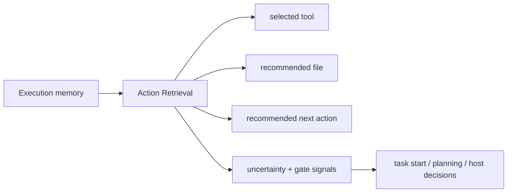

# Action Retrieval

Action Retrieval is the explicit layer that answers the runtime question directly:

`What should the agent do next, and what evidence supports that move?`

In Aionis, this is not hidden inside a generic memory response. It is exposed as its own retrieval surface.

<div class="doc-lead">
  <span class="doc-kicker">What this layer does</span>
  <p>Action Retrieval turns execution memory into a concrete next-step recommendation with evidence, source kind, and confidence. It is the shortest path from past execution to the next useful move.</p>
  <div class="doc-chip-row">
    <span class="doc-chip">selected tool</span>
    <span class="doc-chip">file path</span>
    <span class="doc-chip">next action</span>
    <span class="doc-chip">evidence entries</span>
    <span class="doc-chip">source kind</span>
  </div>
</div>

## Why this matters

Many memory systems stop at recall.

They can bring back relevant text, vectors, or messages, but they still leave the host to infer:

- which tool to use
- which file to touch
- what the first real action should be

Action Retrieval closes that gap. It turns memory into an explicit action recommendation instead of leaving the last step to guesswork.

## What comes back

The important fields are:

- `selected_tool`
- `recommended_file_path`
- `recommended_next_action`
- `tool_source_kind`
- `evidence.entries`
- `uncertainty`

The source kind tells you where the recommendation came from. In practice that usually means one of:

- stable workflow reuse
- trusted pattern reuse
- persisted policy memory
- a blended result across multiple strong signals

## Minimal example

```ts
const retrieval = await aionis.memory.actionRetrieval({
  tenant_id: "default",
  scope: "repair-flow",
  query_text: "repair billing retry serializer bug",
  context: {
    goal: "repair billing retry serializer bug",
    task_kind: "repair_billing_retry",
  },
  candidates: ["bash", "edit", "test"],
});
```

Read these fields first:

1. `retrieval.selected_tool`
2. `retrieval.recommended_file_path`
3. `retrieval.recommended_next_action`
4. `retrieval.evidence.entries`
5. `retrieval.uncertainty`

## How it fits into the runtime



Action Retrieval sits between stored execution evidence and the surfaces that need to decide whether to act immediately or gather more context first.

## Related surfaces

- `memory.actionRetrieval(...)`
- `memory.experienceIntelligence(...)`
- `memory.taskStart(...)`
- `memory.planningContext(...)`

If you want to understand what happens when retrieval is not strong enough, continue to [Uncertainty and Gates](./uncertainty-and-gates.md).

## Deep dives

- [Memory reference](../reference/memory.md)
- [SDK Client and Host Bridge](../sdk/client-and-bridge.md)
- [Uncertainty and Gates](./uncertainty-and-gates.md)
