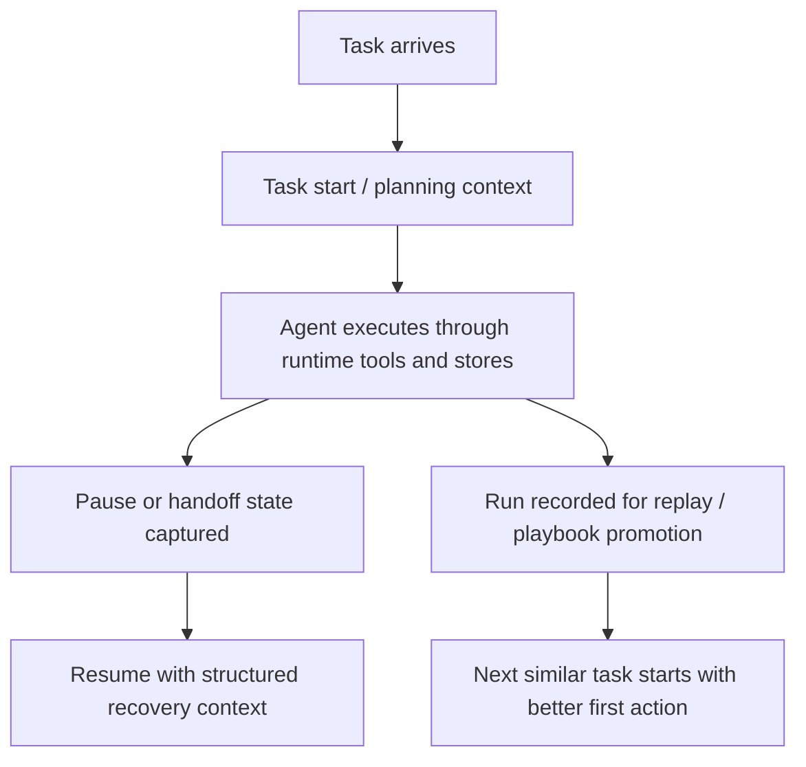

# What Aionis Runtime is

`Aionis Runtime` is a self-evolving continuity runtime for agent systems.

  Short version
  
Aionis Runtime is the public runtime layer in this repository. It exists to make repeated work start better, paused work resume cleanly, and successful work become reusable operating knowledge.

  

    Task start
    Structured handoff
    Replay and playbooks
    Lite runtime today
  

`Aionis Runtime` is the public runtime in this repository.  
`Aionis Core` is the kernel beneath it.  
`Lite` is the runtime shape that ships publicly today.

The purpose of the runtime is straightforward:

1. help repeated work start with better execution context
2. help paused work resume from structured runtime state
3. help successful work become reusable operating knowledge

## The default product path

  

    Core
    <h3>Continuity baseline</h3>
    
Use write, planning or task start, handoff, and replay to prove that repeated work no longer starts from zero and paused work no longer resumes from guesswork.

    <code class="reference-route">write -> planning/taskStart -> handoff -> replay</code>
  

  

    Enhanced
    <h3>Self-improvement loop</h3>
    
Add lifecycle reuse, review packs, and sessions so the runtime can reactivate useful nodes, record reuse quality, and expose continuity state to humans or hosts.

    <code class="reference-route">rehydrate -> activate -> reviewPacks -> sessions</code>
  

  

    Advanced
    <h3>Kernel control surfaces</h3>
    
Add experience intelligence, execution introspection, delegation records, tools, rules, patterns, and payload helpers when you need a deeper learning and governance substrate.

    <code class="reference-route">introspect -> delegate -> tools/rules/patterns</code>
  

  Why this matters
  
The public memory surface is wide. If you present everything as one flat story, users either miss the real power or feel buried in endpoints. The layered product path solves that: the core path proves continuity, the enhanced path proves self-improvement, and the advanced path exposes deeper substrate controls for more serious hosts.

## The failure it targets

The problem is not generic “AI memory”.

The concrete failure is agent continuity:

1. a familiar task comes in and the agent still starts from zero
2. a paused task is resumed and the agent has no trustworthy execution state
3. a successful repair finishes and the knowledge disappears instead of becoming reusable

That failure is especially visible in coding workflows, but it is not limited to coding. Any agent workflow that depends on reliable startup guidance, pause/resume, or replay reuse will hit the same continuity problem.

## What Aionis Runtime does

The runtime exposes three core surfaces:

1. **Task start**
   Turn prior execution into a better first action for the next similar task.
2. **Task handoff**
   Store execution-ready handoff packets with target files, next action, and recovery context.
3. **Task replay**
   Record successful runs, compile reusable playbooks, and promote them into stable workflow guidance.

Around those surfaces, Lite also exposes local automation, sandbox, and review-oriented runtime paths.

## Where the other valuable surfaces fit

Not every valuable capability belongs in the first evaluation loop.

- `experienceIntelligence(...)` and `executionIntrospect(...)` belong in the advanced path because they help a host inspect and tune how learning is accumulating.
- `sessions.*` and `reviewPacks.*` belong in the enhanced path because they make continuity persist beyond a single answer and make review possible.
- `delegationRecords.*` belongs in the advanced path because it matters most when multi-agent learning becomes explicit.
- `tools.*`, `rules.*`, and `patterns.*` belong in the advanced path because they govern learned behavior rather than simply exposing outputs.

## What "self-evolving" means here

The runtime is not claiming magical self-improvement in the abstract.

In Aionis, self-evolving means that later execution can be informed by earlier execution through explicit runtime structures:

1. previous execution evidence can influence the next task start
2. a paused task can be resumed from structured handoff state
3. successful runs can be replayed, compiled, and promoted into reusable playbooks
4. memory lifecycle routes can rehydrate useful nodes and record activation feedback

The system improves because continuity is persisted and reused, not because the product merely promises "AI memory".

  core continuity
  enhanced reuse
  advanced controls
  Aionis should feel deeper over time, not heavier on day one.

## Single-agent and multi-agent use

The current public runtime is especially well suited to:

- coding agents
- ops and automation agents
- task-oriented hosts that need pause/resume
- multi-agent systems that need trustworthy handoff between workers

The common requirement is not domain. The common requirement is continuity.

## What the runtime is not

Aionis Runtime is not:

- a hosted control plane
- a generic chat memory plugin
- a vague orchestration wrapper with continuity hidden in prompts
- a replacement for the model, agent UI, or workflow host you already use

Instead, it sits underneath those systems as continuity infrastructure.

## Why the runtime shape matters

The key design choice is that continuity is exposed as runtime infrastructure:

- typed SDK contracts instead of hidden prompt state
- replay, handoff, and kickoff as explicit APIs
- local persistence instead of fragile session text
- automation and sandbox capability around those same flows

This makes the runtime easier to inspect, integrate, validate, and extend.

## How the execution loop works

This is the loop Aionis is trying to own. The runtime is not only storing data; it is trying to improve later execution quality.

## What ships today

- a Lite local runtime with SQLite-backed persistence
- a public SDK through `@ostinato/aionis`
- replay, handoff, automation, sandbox, and review-pack surfaces
- validation evidence through smoke tests, contract tests, and benchmark reports

## How to think about the public product

Use this mental model:

| Layer | What it means |
| --- | --- |
| `Aionis Core` | The underlying kernel concepts and runtime substrate |
| `Aionis Runtime` | The public runtime shape you integrate against |
| `Lite` | The local distribution that ships publicly today |

If you are evaluating or integrating Aionis, you mainly care about `Aionis Runtime` and `Lite`.

## Recommended reading order

1. [Why Aionis](./why-aionis.md)
2. [Architecture Overview](./architecture/overview.md)
3. [Getting Started](./getting-started.md) for the core path
4. [SDK Quickstart](./sdk/quickstart.md) for the full layered path
5. [Task Start](./concepts/task-start.md)
6. [Handoff](./concepts/handoff.md)
7. [Replay](./concepts/replay.md)
8. [Memory](./reference/memory.md) for enhanced and advanced surfaces
9. [Lite Runtime](./runtime/lite-runtime.md)
10. [Contracts and Routes](./reference/contracts-and-routes.md)

  <a class="doc-card" href="./getting-started.md">
    Start using it
    <h3>Getting Started</h3>
    
Boot Lite locally, point the SDK at it, and confirm the runtime is alive.

  </a>
  <a class="doc-card" href="./sdk/quickstart.md">
    Integrate it
    <h3>SDK Quickstart</h3>
    
Write memory, ask for task start, store handoff, and move into replay through the public client.

  </a>
  <a class="doc-card" href="./architecture/overview.md">
    Understand it
    <h3>Architecture Overview</h3>
    
Read the runtime shell, bootstrap, host, kernel, and store seams that make Lite explicit.

  </a>

## After this page

If you want to keep going in the shortest useful order:

1. read [Why Aionis](./why-aionis.md) for the differentiators
2. read [Architecture Overview](./architecture/overview.md) for the runtime shape
3. read [Getting Started](./getting-started.md) or [SDK Quickstart](./sdk/quickstart.md) to evaluate the public path
