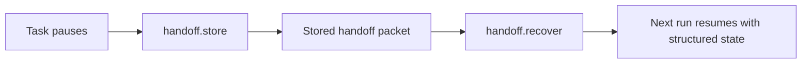

# Handoff reference

Handoff is the runtime surface for trustworthy pause and resume.

The point is not to save another prose summary. The point is to store execution-ready task state that the next run can trust.

<div class="doc-lead">
  <span class="doc-kicker">Pause/resume substrate</span>
  <p>Handoff is where Aionis turns "come back to this later" into a recoverable runtime object. A good handoff preserves where work stopped, what files matter, what should happen next, and how the next run can tell whether the resume succeeded.</p>
  <div class="doc-chip-row">
    <span class="doc-chip">Anchor-based recovery</span>
    <span class="doc-chip">Target files</span>
    <span class="doc-chip">Next action</span>
    <span class="doc-chip">Acceptance checks</span>
  </div>
</div>

<div class="comparison-grid">
  <div class="comparison-card comparison-wrong">
    <span class="comparison-label">Weak handoff</span>
    <h3>Past-tense summary</h3>
    <p>It says what happened, but not how the next run should safely re-enter the task.</p>
    <ul>
      <li>No stable anchor</li>
      <li>No target files</li>
      <li>No next action</li>
      <li>No acceptance checks</li>
    </ul>
  </div>
  <div class="comparison-card comparison-right">
    <span class="comparison-label">Execution-ready handoff</span>
    <h3>Resume contract</h3>
    <p>It constrains what the next run should open, do, and validate before calling the resume successful.</p>
    <ul>
      <li>Stable anchor</li>
      <li>Concrete target files</li>
      <li>Explicit next action</li>
      <li>Resume validation checks</li>
    </ul>
  </div>
</div>

<div class="section-frame">
  <span class="doc-kicker">Resume contract</span>
  <p>Think of handoff as a contract, not a note. The contract says where the next run should attach, what object it should touch first, what must remain true, and how the host can tell whether recovery actually worked. If those constraints are missing, the runtime may recover the packet but still fail to resume the work well.</p>
</div>

<div class="state-strip">
  <span class="state-badge state-trusted">trusted resume</span>
  <span class="state-badge state-candidate">candidate resume</span>
  <span class="state-badge state-contested">contested resume</span>
  <span class="state-note">Handoff quality is really resume quality seen one step earlier.</span>
</div>

## Mental model



The important point is that handoff stores runtime-readable state, not just a note for a human.

<div class="section-frame">
  <span class="doc-kicker">Reading rule</span>
  <p>Read handoff in three passes: first the anchor and next action, then the target files and acceptance checks, then the optional execution packet fields. That order mirrors the real recovery path. If the first pass is weak, the extra packet structure will not save the resume.</p>
</div>

## Public SDK methods

| SDK method | Route | Purpose |
| --- | --- | --- |
| `handoff.store(...)` | `POST /v1/handoff/store` | Persist a structured handoff |
| `handoff.recover(...)` | `POST /v1/handoff/recover` | Recover a handoff by anchor |

## How to choose the right handoff path

| Situation | Best choice |
| --- | --- |
| Your host already owns task/session lifecycle | Use the host bridge pause/resume helpers |
| You want an explicit cross-run checkpoint | Use `handoff.store(...)` directly |
| Another worker or operator must resume later | Use direct handoff storage with a strong anchor |
| You only need transcript notes | Do not use handoff alone; it is overkill for prose-only notes |

## The important handoff fields

These are the fields that matter most in practice:

1. `anchor`
2. `summary`
3. `handoff_text`
4. `target_files`
5. `next_action`
6. `acceptance_checks`

If those fields are weak, resume quality will also be weak.

## What a strong handoff looks like

Strong handoffs usually include:

1. one stable `anchor` that the next run can recover by
2. a short `summary` of where the task stopped
3. `handoff_text` that tells the next worker exactly where to re-enter
4. concrete `target_files`
5. one explicit `next_action`
6. validation in `acceptance_checks`

Weak handoffs usually fail because they describe the past without constraining the future.

## Minimal store example

```ts
await aionis.handoff.store({
  tenant_id: "default",
  scope: "repair-flow",
  anchor: "task:export-repair",
  summary: "Pause after diagnosis",
  handoff_text: "Resume in src/routes/export.ts and patch the serializer mismatch.",
  target_files: ["src/routes/export.ts"],
  next_action: "Patch the export serializer and rerun the relevant checks.",
  acceptance_checks: ["npm run -s test:lite -- export"],
});
```

If the task needs stronger resume fidelity, you can also include fields such as:

- `must_change`
- `must_remove`
- `must_keep`
- `execution_state_v1`
- `execution_packet_v1`

Those become more important when the resume path must preserve invariants rather than only continue rough work.

## Minimal recover example

```ts
const recovered = await aionis.handoff.recover({
  tenant_id: "default",
  scope: "repair-flow",
  anchor: "task:export-repair",
});

console.log(recovered);
```

On the recovery side, the most useful first reads are usually:

1. the recovered summary
2. the recovered `target_files`
3. the recovered `next_action`
4. any acceptance or rollback expectations carried in the payload

## When to use handoff directly

Use direct handoff APIs when:

1. your host already manages task identity itself
2. you want an explicit pause checkpoint
3. another run or operator will pick work back up later

## When to use the host bridge instead

Use the host bridge when your app already has a task session lifecycle and you want pause/resume to live inside that session adapter.

That path gives you:

1. `openTaskSession(...)`
2. `inspectTaskContext(...)`
3. `pauseTask(...)`
4. `resumeTask(...)`
5. `completeTask(...)`

The bridge is especially useful when pause/resume is part of a richer host experience rather than a raw route call.

<div class="section-frame">
  <span class="doc-kicker">Direct route vs bridge</span>
  <p>Use the raw handoff APIs when your host already owns task identity or you need a standalone checkpoint object. Use the host bridge when pause and resume are part of a richer task lifecycle that already has sessions, task context inspection, and completion semantics. Both are valid; the difference is whether handoff is the whole checkpoint or one capability inside a larger host contract.</p>
</div>

## Common handoff mistakes

Most poor resume behavior comes from one of these:

1. no stable anchor
2. `handoff_text` that says what happened but not what to do next
3. missing `target_files`
4. no acceptance checks for the resumed task
5. writing a handoff too early, before the current run actually knows where the task should resume

If the next run still feels lost, the handoff is usually underspecified rather than the route being broken.

## Lite behavior notes

In Lite:

1. handoff store and recover are fully supported
2. local identity defaults can fill missing actor context
3. handoff is meant to work as part of the local continuity loop, not as a hosted orchestration layer

That means handoff in Lite is already useful, but it should still be read as part of:

- `task start`
- `handoff`
- `replay`

rather than as a standalone workflow platform.

## Related docs

1. [Handoff concept](../concepts/handoff.md)
2. [Pause and Resume guide](../guides/pause-and-resume.md)
3. [Client and Host Bridge](../sdk/client-and-bridge.md)
4. [Review Runtime](./review-runtime.md)
