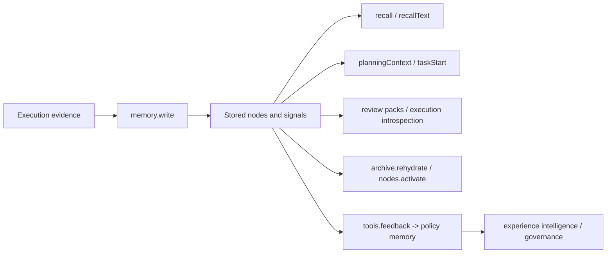

# Memory reference

The memory surface is the widest part of the public SDK. It covers write, recall, lifecycle, planning, task start, sessions, rules, tools, review packs, and a few debugging-oriented endpoints.

<div class="doc-lead">
  <span class="doc-kicker">What memory means here</span>
  <p>Aionis memory is not just "stored context." It is the substrate behind task start, planning context, lifecycle reuse, review packs, and workflow learning. The memory surface is where execution evidence becomes continuity infrastructure.</p>
  <div class="doc-chip-row">
    <span class="doc-chip">Write + recall</span>
    <span class="doc-chip">Planning context</span>
    <span class="doc-chip">Lifecycle reuse</span>
    <span class="doc-chip">Policy memory</span>
    <span class="doc-chip">Review material</span>
  </div>
</div>

<div class="reference-grid">
  <div class="reference-tile">
    <span class="reference-kicker">Write + recall</span>
    <h3>Evidence intake</h3>
    <p>Persist real execution evidence, then read it back through structured recall and natural-language recall.</p>
    <code class="reference-route">/v1/memory/write</code>
  </div>
  <div class="reference-tile">
    <span class="reference-kicker">Planning</span>
    <h3>Context assembly</h3>
    <p>Assemble planner-facing context, layered recall, and kickoff signals before an agent makes its first move.</p>
    <code class="reference-route">/v1/memory/planning/*</code>
  </div>
  <div class="reference-tile">
    <span class="reference-kicker">Task start</span>
    <h3>First-action guidance</h3>
    <p>Turn accumulated evidence into a better opening move for repeated work instead of restarting from scratch.</p>
    <code class="reference-route">/v1/memory/kickoff/*</code>
  </div>
  <div class="reference-tile">
    <span class="reference-kicker">Lifecycle</span>
    <h3>Reuse signals</h3>
    <p>Rehydrate archived nodes and record whether reused memory actually helped when it was brought back.</p>
    <code class="reference-route">/v1/memory/archive/*</code>
  </div>
  <div class="reference-tile">
    <span class="reference-kicker">Review</span>
    <h3>Review-ready packs</h3>
    <p>Package continuity and evolution state into structures a human or host can inspect without reading raw stores.</p>
    <code class="reference-route">/v1/memory/*review*</code>
  </div>
  <div class="reference-tile">
    <span class="reference-kicker">Evolution</span>
    <h3>Policy memory</h3>
    <p>Persist stable tool policy, read it back through experience intelligence, and govern whether it stays active.</p>
    <code class="reference-route">/v1/memory/tools/* + /v1/memory/policies/*</code>
  </div>
  <div class="reference-tile">
    <span class="reference-kicker">Sessions + helpers</span>
    <h3>Longer-lived continuity</h3>
    <p>Carry memory across sessions, packs, delegation records, rules, tools, and pattern-level helper surfaces.</p>
    <code class="reference-route">/v1/memory/sessions/*</code>
  </div>
</div>

<div class="section-frame">
  <span class="doc-kicker">Operating rule</span>
  <p>Read this page in one direction: write evidence first, assemble planning context second, ask for task-start guidance third, then use lifecycle and review paths only when continuity quality and reuse quality start to matter. If you begin at the heavy helper surfaces, the memory model will feel much more complicated than it really is.</p>
</div>

<div class="state-strip">
  <span class="state-badge state-trusted">trusted recall</span>
  <span class="state-badge state-candidate">candidate kickoff</span>
  <span class="state-badge state-contested">contested patterns</span>
  <span class="state-badge state-governed">governed review</span>
  <span class="state-note">Memory gets stronger only when evidence, reuse, and review stay connected.</span>
</div>

## Mental model

Use this mental model for the memory surface:



Memory in Aionis is useful because later runtime paths can build on it. It is not only a storage bucket.

## Core memory families

The public memory surface breaks down into eight practical groups:

1. write and recall
2. archive rehydrate and node activation lifecycle
3. planning and context assembly
4. task start and experience intelligence
5. sessions, packs, find, and resolve
6. rules, tools, patterns, and payload rehydration
7. policy memory, evolution review, and governance
8. review packs and delegation-learning support

<div class="section-frame">
  <span class="doc-kicker">Decision frame</span>
  <p>Memory is not the place to force full orchestration. Its job is narrower and more important: hold execution evidence, assemble better startup context, track reuse signals, and expose review-ready continuity state. Shell execution, hosted governance, and model capability still live elsewhere.</p>
</div>

## How to choose the right call

| If you want to... | Start with... |
| --- | --- |
| Persist new execution evidence | `memory.write(...)` |
| Search with natural language | `memory.recallText(...)` |
| Get planner-facing context | `memory.planningContext(...)` |
| Get the best next first move | `memory.taskStart(...)` |
| Inspect heavier workflow and learning state | `memory.experienceIntelligence(...)` or `memory.executionIntrospect(...)` |
| Bring archived memory back into active use | `memory.archive.rehydrate(...)` |
| Record whether reused memory helped | `memory.nodes.activate(...)` |
| Build review-ready state | `memory.reviewPacks.*` |

## Most-used SDK calls

| SDK method | Route | What it is for |
| --- | --- | --- |
| `memory.write(...)` | `POST /v1/memory/write` | Persist execution evidence into Lite |
| `memory.archive.rehydrate(...)` | `POST /v1/memory/archive/rehydrate` | Bring archived nodes back into `warm` or `hot` in Lite |
| `memory.nodes.activate(...)` | `POST /v1/memory/nodes/activate` | Record reuse outcome and activation feedback on Lite nodes |
| `memory.recallText(...)` | `POST /v1/memory/recall_text` | Ask recall using natural language |
| `memory.planningContext(...)` | `POST /v1/memory/planning/context` | Get planner-facing recall and kickoff context |
| `memory.contextAssemble(...)` | `POST /v1/memory/context/assemble` | Build final context runtime payload |
| `memory.experienceIntelligence(...)` | `POST /v1/memory/experience/intelligence` | Inspect learned workflow and tool guidance |
| `memory.taskStart(...)` | `POST /v1/memory/kickoff/recommendation` | Get the best first action for a repeated task |
| `memory.executionIntrospect(...)` | `POST /v1/memory/execution/introspect` | Pull the heavier local introspection surface |
| `memory.tools.feedback(...)` | `POST /v1/memory/tools/feedback` | Record tool outcome and potentially materialize policy memory |
| `memory.reviewPacks.evolution(...)` | `POST /v1/memory/evolution/review-pack` | Review evolution state, policy review, and governance contracts |
| `memory.policies.governanceApply(...)` | `POST /v1/memory/policies/governance/apply` | Retire or reactivate a persisted policy memory |

## Minimal write example

```ts
await aionis.memory.write({
  tenant_id: "default",
  scope: "repair-flow",
  actor: "docs-example",
  input_text:
    "Patched serializer handling in src/routes/export.ts and verified the export response shape.",
});
```

What makes a good write:

1. the scope matches the work you want to improve later
2. the text records real execution, not generic commentary
3. the actor and tenant are consistent with later reads

Weak writes produce weak later task starts.

## Minimal planning example

```ts
const planning = await aionis.memory.planningContext({
  tenant_id: "default",
  scope: "repair-flow",
  query_text: "repair export response serialization bug",
  context: {
    goal: "repair export response serialization bug",
    task_kind: "repair_export",
  },
  tool_candidates: ["bash", "edit", "test"],
  return_layered_context: true,
});
```

Read these fields first:

1. `kickoff_recommendation`
2. `planner_packet`
3. `workflow_signals`
4. `pattern_signals`

## Task-start surfaces

If you want the shortest public entrypoint into memory-guided continuity, these are the important calls:

| SDK method | What comes back |
| --- | --- |
| `memory.taskStart(...)` | A compact `first_action` derived from kickoff recommendation |
| `memory.kickoffRecommendation(...)` | The raw kickoff response and rationale |
| `memory.experienceIntelligence(...)` | Workflow, tool, and learning-oriented guidance |

Use `taskStart` first when you want the best first move. Use `planningContext` first when you want more than one hint and need the runtime to assemble planner-facing context.

## Recommended call order

If you are integrating memory for the first time, this is the best progression:

1. `memory.write(...)`
2. `memory.recallText(...)`
3. `memory.planningContext(...)`
4. `memory.taskStart(...)`
5. `memory.archive.rehydrate(...)` and `memory.nodes.activate(...)` when reuse quality starts to matter

That order helps you understand the surface from evidence ingestion to better startup guidance.

## Lifecycle surfaces

Lite now includes the local memory lifecycle routes through the public SDK:

```ts
await aionis.memory.archive.rehydrate({
  tenant_id: "default",
  scope: "repair-flow",
  client_ids: ["billing-timeout-repair"],
  target_tier: "warm",
  reason: "bring the archived repair memory back into the active set",
});

await aionis.memory.nodes.activate({
  tenant_id: "default",
  scope: "repair-flow",
  client_ids: ["billing-timeout-repair"],
  outcome: "positive",
  activate: true,
  reason: "the rehydrated node helped complete the repair",
});
```

These lifecycle calls matter because they let Lite distinguish between:

- memory that exists
- memory that should be active again
- memory that proved useful when reused

That is one of the main reasons the runtime can plausibly claim self-evolving continuity rather than static storage.

## Continuity carriers and provenance

Lite now treats several runtime records as explicit continuity carriers:

- `handoff`
- `session_event`
- `session`

These are not only recallable records. They can now act as learning inputs that project into workflow memory.

What changed in practice:

1. the carrier is normalized into execution-native memory
2. the resulting workflow candidate keeps a `distillation_origin`
3. stable workflow promotion preserves that origin instead of erasing it
4. planning and introspection surfaces expose that provenance directly

The important public signals are:

- `planning_summary.continuity_carrier_summary`
- `planning_summary.distillation_signal_summary`
- `planner_packet.sections.candidate_workflows`
- `executionIntrospect(...).demo_surface.sections.workflows`

The most useful origin values to recognize are:

| Origin | What it means |
| --- | --- |
| `handoff_continuity_carrier` | This workflow was learned from structured handoff state |
| `session_event_continuity_carrier` | This workflow was learned from repeated session events |
| `session_continuity_carrier` | This workflow was learned from session-scoped continuity state |
| `execution_write_projection` | This workflow was projected from execution-native write evidence |
| `replay_learning_episode` | This workflow came from replay learning and playbook reuse |

This is one of the most important recent Memory v2 upgrades, because it turns continuity learning from:

- implicit
- buried in raw slots
- hard to trust

into something visible and auditable through the default runtime summaries.

## Policy memory and evolution

The newest self-evolving surface in public Lite is policy memory.

This is the loop:

1. `memory.tools.feedback(...)` records whether a tool decision worked
2. stable pattern and workflow evidence can materialize a persisted policy memory
3. `memory.experienceIntelligence(...)` can read that memory back as a live `policy_contract`
4. `memory.executionIntrospect(...)` and `memory.reviewPacks.evolution(...)` can inspect it
5. `memory.policies.governanceApply(...)` can retire or reactivate it

If you want the fuller walkthrough, read [Policy Memory and Evolution](./policy-memory.md).

## Sessions and review-oriented helpers

These surfaces are useful when your host needs continuity state beyond a single task-start answer:

| SDK method family | Purpose |
| --- | --- |
| `memory.sessions.*` | Create sessions and append local session events |
| `memory.packs.*` | Export or import local packs |
| `memory.find(...)` / `memory.resolve(...)` | Direct local lookup and node resolution |
| `memory.reviewPacks.*` | Pull continuity or evolution review material |
| `memory.delegationRecords.*` | Read or write delegation-learning records |

Use these helpers when continuity is bigger than one answer:

- sessions when a task persists over time
- review packs when a human or host needs review-ready state
- delegation records when multi-agent learning needs to be kept explicitly

## Tools, rules, and patterns

Lite also exposes a narrower local policy-learning loop:

| SDK method family | Purpose |
| --- | --- |
| `memory.tools.select(...)` | Tool selection decision path |
| `memory.tools.feedback(...)` | Store tool feedback and distill tool outcomes |
| `memory.rules.state(...)` | Update local rule state |
| `memory.rules.evaluate(...)` | Evaluate Lite rules |
| `memory.patterns.suppress(...)` | Operator stop-loss on a learned pattern |
| `memory.anchors.rehydratePayload(...)` | Expand an anchor-linked payload |

This family is easy to ignore, but it matters when the host needs more control over learned behavior rather than only consuming output recommendations.

## Common integration mistakes

Most disappointing first integrations come from one of these:

1. writing generic notes and expecting strong task-start guidance
2. mixing unrelated work into the same scope
3. querying one scope and writing into another
4. expecting hosted control-plane behavior from Lite-local routes
5. treating `taskStart` as magic instead of as a surface fed by execution evidence

If the runtime feels sparse, the first thing to inspect is usually the shape and quality of the written evidence.

## Lite boundary notes

Three things matter when integrating against Lite:

1. archive rehydrate and node activation lifecycle routes are part of Lite now
2. admin control and broader server-only control-plane routes still return structured `501`
3. heavy route-by-route debugging still belongs in the repository capability matrix

Lite is honest about its boundary, but the memory lifecycle surface is now inside the public local runtime.

## What memory is responsible for vs not responsible for

| Inside the memory surface | Outside the memory surface |
| --- | --- |
| execution evidence | hosted admin control plane |
| recall and planning context | full remote orchestration |
| task-start guidance | model capability itself |
| lifecycle reuse signals | arbitrary shell execution |
| review-ready runtime material | unrelated product analytics |

## Raw contract sources

When you need exact field names, read:

1. [`packages/full-sdk/src/contracts.ts`](https://github.com/ostinatocc/AionisCore/blob/main/packages/full-sdk/src/contracts.ts)
2. [LOCAL_RUNTIME_API_CAPABILITY_MATRIX.md](https://github.com/ostinatocc/AionisCore/blob/main/docs/LOCAL_RUNTIME_API_CAPABILITY_MATRIX.md)

## Related docs

1. [SDK Quickstart](../sdk/quickstart.md)
2. [Task Start](../concepts/task-start.md)
3. [Contracts and Routes](./contracts-and-routes.md)
