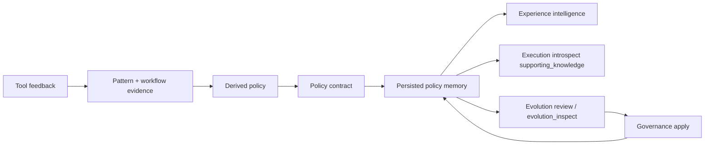

# Policy memory and evolution

Policy memory is where Aionis stops being only a continuity runtime and starts persisting reusable execution policy.

<div class="doc-lead">
  <span class="doc-kicker">What this surface means</span>
  <p>Task start, replay, and review can now converge on a persisted policy surface. Positive tool feedback can materialize a policy memory node, experience intelligence can read it back as a live contract, evolution review can inspect it, and governance can retire or reactivate it.</p>
  <div class="doc-chip-row">
    <span class="doc-chip">policy_hints</span>
    <span class="doc-chip">derived_policy</span>
    <span class="doc-chip">policy_contract</span>
    <span class="doc-chip">governance apply</span>
  </div>
</div>

<div class="reference-grid">
  <div class="reference-tile">
    <span class="reference-kicker">Materialize</span>
    <h3>Write a policy memory</h3>
    <p>Positive tool feedback can turn stable pattern and workflow evidence into a persisted policy memory node.</p>
    <code class="reference-route">POST /v1/memory/tools/feedback</code>
  </div>
  <div class="reference-tile">
    <span class="reference-kicker">Read live policy</span>
    <h3>Expose the current contract</h3>
    <p>Experience intelligence can return policy hints, a derived policy, and the effective policy contract for the current task.</p>
    <code class="reference-route">POST /v1/memory/experience/intelligence</code>
  </div>
  <div class="reference-tile">
    <span class="reference-kicker">Inspect</span>
    <h3>Review persisted policy state</h3>
    <p>Execution introspection and evolution review expose persisted policy memory through supporting knowledge and evolution inspect summaries.</p>
    <code class="reference-route">POST /v1/memory/execution/introspect</code>
  </div>
  <div class="reference-tile">
    <span class="reference-kicker">Govern</span>
    <h3>Retire or reactivate</h3>
    <p>Policy governance can explicitly retire or reactivate a persisted policy memory when review says the current default is wrong or should be restored.</p>
    <code class="reference-route">POST /v1/memory/policies/governance/apply</code>
  </div>
</div>

<div class="state-strip">
  <span class="state-badge state-trusted">active policy memory</span>
  <span class="state-badge state-candidate">computed contract</span>
  <span class="state-badge state-contested">contested policy</span>
  <span class="state-badge state-governed">retire / reactivate</span>
  <span class="state-note">The key distinction is whether the current policy is only computed from live evidence or already persisted and governable.</span>
</div>

<div class="section-frame">
  <span class="doc-kicker">Reading rule</span>
  <p>Read this page as one loop: feedback can materialize policy memory, runtime calls can read that memory back as a live contract, evolution review can inspect whether it should still apply, and governance can explicitly change its lifecycle state.</p>
</div>

## Mental model



The loop matters because a self-evolving runtime should not only compute a recommendation once. It should be able to persist, inspect, and govern that recommendation over time.

## Where this appears in the public SDK

| SDK method | Route | What it returns or changes |
| --- | --- | --- |
| `memory.tools.feedback(...)` | `POST /v1/memory/tools/feedback` | May materialize `policy_memory` when positive feedback stabilizes a policy |
| `memory.experienceIntelligence(...)` | `POST /v1/memory/experience/intelligence` | Returns `policy_hints`, `derived_policy`, and `policy_contract` |
| `memory.executionIntrospect(...)` | `POST /v1/memory/execution/introspect` | Exposes persisted policy memory in `supporting_knowledge` |
| `memory.reviewPacks.evolution(...)` | `POST /v1/memory/evolution/review-pack` | Returns `evolution_inspect`, policy review, governance contract, and optional apply payload/result |
| `memory.policies.governanceApply(...)` | `POST /v1/memory/policies/governance/apply` | Retires or reactivates a persisted policy memory |

## The key objects

### `policy_hints`

This is the lightweight hint surface.

Use it when you want to know:

- which tool is being preferred
- which contested tool should be avoided
- whether payload rehydration is being suggested
- whether workflow reuse is part of the recommendation

Hints are useful for explanation, but they are not yet a full persisted contract.

### `derived_policy`

This is the current policy surface synthesized from live evidence.

It tells you:

- the `selected_tool`
- whether the source is `trusted_pattern`, `stable_workflow`, or `blended`
- the likely `file_path` or `target_files`
- why that policy currently exists

Think of it as the runtime's present-tense policy hypothesis.

### `policy_contract`

This is the runtime-facing contract the host should care about most.

It tells you:

- whether the policy is only `computed` or already `persisted`
- whether it is `active`, `contested`, or `retired`
- whether it should apply as `default` or only as `hint`
- which anchors and files support the contract

That distinction is what turns "learning" into something governable.

### Persisted policy memory

Persisted policy memory is a real node in Lite memory, not only a transient field in a response.

You will see it:

- in `tools.feedback(...).policy_memory`
- inside `executionIntrospect(...).supporting_knowledge`
- inside `reviewPacks.evolution(...).evolution_inspect`

This is the layer that makes policy state durable and reviewable.

### `evolution_inspect`

There is no separate public `memory.evolutionInspect(...)` route today.

Instead, evolution inspect is exposed through `memory.reviewPacks.evolution(...)`. That response now includes:

- `experience_intelligence`
- `policy_hints`
- `derived_policy`
- `policy_contract`
- `policy_review`
- `policy_governance_contract`
- optional `policy_governance_apply_payload`
- optional `policy_governance_apply_result`

So the inspect surface is real, but it currently arrives through the evolution review path rather than a standalone route.

## Minimal loop

### 1. Positive tool feedback can materialize policy memory

```ts
const feedback = await aionis.memory.tools.feedback({
  tenant_id: "default",
  scope: "repair-flow",
  actor: "sdk-demo",
  outcome: "positive",
  selected_tool: "edit",
  target: "tool",
  input_text: "repair export response serialization bug",
  context: {
    task_kind: "repair_export",
    goal: "repair export response serialization bug",
    file_path: "src/routes/export.ts",
  },
  candidates: ["bash", "edit", "test"],
});

console.log(feedback.policy_memory);
```

What to look for:

1. `policy_memory.node_id`
2. `policy_memory.policy_contract.materialization_state`
3. `policy_memory.policy_contract.policy_memory_state`

### 2. Experience intelligence can read the persisted contract back

```ts
const experience = await aionis.memory.experienceIntelligence({
  tenant_id: "default",
  scope: "repair-flow",
  query_text: "repair export response serialization bug",
  context: {
    task_kind: "repair_export",
    goal: "repair export response serialization bug",
    file_path: "src/routes/export.ts",
  },
  candidates: ["bash", "edit", "test"],
});

console.log(experience.policy_contract);
```

When persisted policy memory is being reused correctly, the contract should stop looking purely computed and start pointing at a real `policy_memory_id`.

### 3. Evolution review can expose the inspect and governance surfaces

```ts
const evolutionPack = await aionis.memory.reviewPacks.evolution({
  tenant_id: "default",
  scope: "repair-flow",
  query_text: "repair export response serialization bug",
  context: {
    task_kind: "repair_export",
    goal: "repair export response serialization bug",
    file_path: "src/routes/export.ts",
  },
  tool_candidates: ["bash", "edit", "test"],
});

console.log(evolutionPack.evolution_review_pack.evolution_inspect);
console.log(evolutionPack.evolution_review_pack.policy_governance_contract);
```

This is the public review path for answering:

- should the current policy stay active?
- is the selected policy contested?
- should the next move be retire, reactivate, or do nothing?

### 4. Governance can retire or reactivate the persisted policy

```ts
await aionis.memory.policies.governanceApply({
  tenant_id: "default",
  scope: "repair-flow",
  policy_memory_id: "2c42c6ea-9d3b-4f75-8e1d-0c7f8efb7c73",
  action: "retire",
  actor: "reviewer",
  reason: "the old default is no longer safe",
});
```

Use this when your host or reviewer has already decided that a persisted policy should no longer apply automatically.

## When this surface is useful

Use policy memory and evolution surfaces when:

- repeated tasks have moved beyond simple kickoff hints
- tool preference is becoming stable enough to persist
- a reviewer or host needs to inspect whether self-improvement is still trustworthy
- you need a reversible lifecycle instead of permanent learned defaults

Do not start here if you are still proving the core continuity loop. This surface matters after task start, handoff, and replay are already working.

## Related docs

1. [Memory](./memory.md)
2. [Review Runtime](./review-runtime.md)
3. [SDK Quickstart](../sdk/quickstart.md)
4. [Lite Runtime](../runtime/lite-runtime.md)
