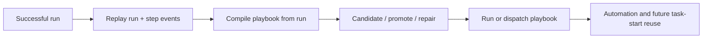

# Replay and playbooks

Replay is the producer side of Aionis Runtime. It records successful execution and turns that execution into reusable operating knowledge.

<div class="doc-lead">
  <span class="doc-kicker">Why replay exists</span>
  <p>Without replay, continuity stays descriptive. Replay is what lets Aionis turn successful execution into something the runtime can promote, dispatch, validate, and reuse later.</p>
  <div class="doc-chip-row">
    <span class="doc-chip">Run lifecycle</span>
    <span class="doc-chip">Playbook compilation</span>
    <span class="doc-chip">Promotion + repair</span>
    <span class="doc-chip">Automation reuse</span>
  </div>
</div>

<div class="reference-grid">
  <div class="reference-tile">
    <span class="reference-kicker">Run lifecycle</span>
    <h3>Capture the execution</h3>
    <p>Open a replay run, record intent and outcome at the step level, and close the run with clear result semantics.</p>
    <code class="reference-route">/v1/memory/replay/run/*</code>
  </div>
  <div class="reference-tile">
    <span class="reference-kicker">Compilation</span>
    <h3>Produce a playbook</h3>
    <p>Turn a completed run into a reusable playbook artifact instead of leaving it as one finished event.</p>
    <code class="reference-route">/v1/memory/replay/playbooks/compile_from_run</code>
  </div>
  <div class="reference-tile">
    <span class="reference-kicker">Promotion</span>
    <h3>Decide reuse status</h3>
    <p>Move a playbook through candidate and promotion decisions before relying on it as stable operating knowledge.</p>
    <code class="reference-route">/v1/memory/replay/playbooks/promote</code>
  </div>
  <div class="reference-tile">
    <span class="reference-kicker">Execution</span>
    <h3>Run or dispatch</h3>
    <p>Execute playbooks locally or dispatch them through the runtime when reuse is ready to be exercised.</p>
    <code class="reference-route">/v1/memory/replay/playbooks/run</code>
  </div>
  <div class="reference-tile">
    <span class="reference-kicker">Repair</span>
    <h3>Patch the workflow</h3>
    <p>Repair a playbook when reuse reveals drift, then decide whether the repaired version should advance.</p>
    <code class="reference-route">/v1/memory/replay/playbooks/repair</code>
  </div>
  <div class="reference-tile">
    <span class="reference-kicker">Review</span>
    <h3>Gate the repair</h3>
    <p>Use replay repair review when changes need an explicit trust decision before they are reused again.</p>
    <code class="reference-route">/v1/memory/replay/playbooks/repair/review</code>
  </div>
</div>

<div class="state-strip">
  <span class="state-badge state-candidate">candidate playbook</span>
  <span class="state-badge state-shadow">shadow validation</span>
  <span class="state-badge state-trusted">trusted reuse</span>
  <span class="state-badge state-governed">governed repair</span>
  <span class="state-note">Replay matters only when one successful run becomes stable future behavior.</span>
</div>

## Mental model



Replay is what pushes the runtime from "it remembers" toward "it can reuse".

<div class="section-frame">
  <span class="doc-kicker">Promotion rule</span>
  <p>Do not treat every successful run as a ready-made workflow. Replay only becomes valuable when the runtime can distinguish one clean success from a stable pattern. Record clearly first, compile second, validate third, and promote only when the behavior is worth repeating.</p>
</div>

## Replay run lifecycle

The base replay flow is:

1. start a run
2. record step before
3. record step after
4. end the run
5. fetch the completed run

| SDK method | Route |
| --- | --- |
| `memory.replay.run.start(...)` | `POST /v1/memory/replay/run/start` |
| `memory.replay.step.before(...)` | `POST /v1/memory/replay/step/before` |
| `memory.replay.step.after(...)` | `POST /v1/memory/replay/step/after` |
| `memory.replay.run.end(...)` | `POST /v1/memory/replay/run/end` |
| `memory.replay.run.get(...)` | `POST /v1/memory/replay/runs/get` |

## What each replay phase is doing

| Phase | Why it exists |
| --- | --- |
| `run.start` | Open a durable execution record for the run |
| `step.before` | Record the intended action and preconditions |
| `step.after` | Record what actually happened |
| `run.end` | Mark the overall outcome and summary |
| `run.get` | Inspect the recorded execution after the fact |

## Minimal replay example

```ts
await aionis.memory.replay.run.start({
  tenant_id: "default",
  scope: "repair-flow",
  actor: "docs-example",
  run_id: "repair-run-1",
  goal: "repair export response serialization bug",
});

await aionis.memory.replay.step.before({
  tenant_id: "default",
  scope: "repair-flow",
  actor: "docs-example",
  run_id: "repair-run-1",
  step_index: 1,
  tool_name: "edit",
  tool_input: { file_path: "src/routes/export.ts" },
});

await aionis.memory.replay.step.after({
  tenant_id: "default",
  scope: "repair-flow",
  actor: "docs-example",
  run_id: "repair-run-1",
  step_index: 1,
  status: "success",
  output_signature: {
    kind: "patch_result",
    summary: "patched export serializer handling",
  },
});
```

To make the run reusable, end it explicitly:

```ts
await aionis.memory.replay.run.end({
  tenant_id: "default",
  scope: "repair-flow",
  actor: "docs-example",
  run_id: "repair-run-1",
  status: "success",
  summary: "patched export serializer and validated the route output",
});
```

## Playbook operations

Once a run ends, the important next step is turning it into a playbook.

| SDK method | Route | Purpose |
| --- | --- | --- |
| `memory.replay.playbooks.compileFromRun(...)` | `POST /v1/memory/replay/playbooks/compile_from_run` | Build a playbook from a completed replay run |
| `memory.replay.playbooks.get(...)` | `POST /v1/memory/replay/playbooks/get` | Fetch one playbook |
| `memory.replay.playbooks.candidate(...)` | `POST /v1/memory/replay/playbooks/candidate` | Evaluate candidate state |
| `memory.replay.playbooks.promote(...)` | `POST /v1/memory/replay/playbooks/promote` | Promote a playbook version |
| `memory.replay.playbooks.repair(...)` | `POST /v1/memory/replay/playbooks/repair` | Patch a playbook definition |
| `memory.replay.playbooks.run(...)` | `POST /v1/memory/replay/playbooks/run` | Execute a playbook locally |
| `memory.replay.playbooks.dispatch(...)` | `POST /v1/memory/replay/playbooks/dispatch` | Dispatch a playbook run |
| `memory.replay.playbooks.repairReview(...)` | `POST /v1/memory/replay/playbooks/repair/review` | Lite replay repair review subset |

## Recommended progression

Use replay in this order:

1. record one successful run cleanly
2. compile a playbook from that run
3. inspect candidate and promotion state
4. promote when the playbook is stable enough
5. run or dispatch the promoted playbook
6. repair and review when reuse needs adjustment

That is the shortest path from one-off success to reusable runtime behavior.

<div class="section-frame">
  <span class="doc-kicker">Execution memory loop</span>
  <p>Replay is the producer side of execution memory. It captures the sequence, playbooks shape that sequence into reusable structure, review gates decide trust, and future task starts can then begin from something stronger than a fresh guess. That whole loop is the reason replay belongs near the center of Aionis rather than at the edge.</p>
</div>

## Compile and promote example

```ts
await aionis.memory.replay.playbooks.compileFromRun({
  tenant_id: "default",
  scope: "repair-flow",
  actor: "docs-example",
  run_id: "repair-run-1",
  playbook_id: "repair-export",
  name: "Repair export serializer",
});

await aionis.memory.replay.playbooks.promote({
  tenant_id: "default",
  scope: "repair-flow",
  actor: "docs-example",
  playbook_id: "repair-export",
  target_status: "active",
  note: "validated on repeated export serializer repairs",
});
```

## Run vs dispatch vs repair

| Call | Use it when... |
| --- | --- |
| `playbooks.run(...)` | you want to execute a playbook directly in Lite |
| `playbooks.dispatch(...)` | you want the runtime to dispatch execution through the playbook path |
| `playbooks.repair(...)` | the playbook needs structural adjustment |
| `playbooks.repairReview(...)` | the repair needs an explicit review decision |

## Why playbooks matter

Without replay, memory only describes what happened. With playbooks, the runtime can start to reuse how work got done.

That is the key loop:

```text
successful execution -> replay run -> playbook -> stable workflow guidance -> better future task start
```

That is why replay is foundational to the "self-evolving" claim. Replay is how successful behavior becomes an asset instead of a finished event.

## Replay provenance and stable workflow anchors

Replay now does a better job of preserving learning provenance when playbooks stabilize.

Two details matter:

1. replay-learning episodes already project candidate workflows with explicit `distillation_origin = "replay_learning_episode"`
2. stable replay workflow anchors now preserve that provenance through promotion and later normalization instead of dropping it

That means a replay-derived stable workflow is no longer just:

- a stable anchor
- a promoted playbook

It is also an inspectable answer to:

`what kind of learning signal created this workflow?`

In practice, that provenance now stays visible through:

- `execution_native_v1.distillation`
- `memory.executionIntrospect(...)`
- `planner packet` and demo workflow lines

This matters because replay is not only creating reusable structure. It is now preserving where that reusable structure came from.

## How replay interacts with the rest of the runtime

Replay is tightly connected to the other public surfaces:

- memory and task start can benefit from promoted playbooks later
- automation can execute playbook-shaped graphs locally
- review runtime can review repaired playbooks before reuse
- handoff can capture state around incomplete or partial runs

So replay should be read as part of the continuity loop, not as an isolated logging feature.

## Common mistakes

Replay integration is usually weak for one of these reasons:

1. steps are recorded too loosely to reconstruct what mattered
2. runs end without clear success/failure semantics
3. teams compile playbooks before a run pattern is actually stable
4. replay is used as audit history only, not as a path to reuse

If replay is not changing future task starts or automation behavior, you are probably recording history without closing the reuse loop.

## Lite boundary notes

Lite supports real replay and playbook behavior, but it is still narrower than a full hosted control plane.

The important boundary is:

1. replay core is fully present
2. governed replay is a Lite subset
3. playbook execution is local-first
4. automation reuses that same local playbook model

This is an important product boundary:

- Lite already supports meaningful replay and local reuse
- Lite does not claim to be a full hosted workflow governance platform

That narrower claim is part of why the runtime is believable.

## Related docs

1. [Replay concept](../concepts/replay.md)
2. [Replay to Playbook guide](../guides/replay-to-playbook.md)
3. [Review Runtime](./review-runtime.md)
4. [Automation](../runtime/automation.md)
5. [Lite Runtime](../runtime/lite-runtime.md)
