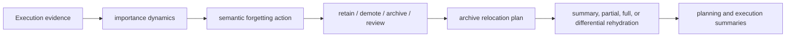

# Semantic forgetting

Semantic forgetting in Aionis is not deletion. It is the runtime's lifecycle layer for deciding when execution memory should stay active, be demoted, be archived, or only be rehydrated on demand.

<div class="doc-lead">
  <span class="doc-kicker">What forgetting means here</span>
  <p>Aionis treats forgetting as execution-memory maintenance. The runtime records whether a memory node should stay hot, move toward colder tiers, relocate payloads, or only be restored through a partial or differential rehydration path.</p>
  <div class="doc-chip-row">
    <span class="doc-chip">retain / demote / archive / review</span>
    <span class="doc-chip">archive relocation</span>
    <span class="doc-chip">differential rehydration</span>
    <span class="doc-chip">summary surfaces</span>
  </div>
</div>

<div class="reference-grid">
  <div class="reference-tile">
    <span class="reference-kicker">Decision</span>
    <h3>Semantic forgetting</h3>
    <p>Lifecycle operators compute whether a node should be retained, demoted, archived, or pushed into review rather than treated as equally active forever.</p>
    <code class="reference-route">slots.semantic_forgetting_v1</code>
  </div>
  <div class="reference-tile">
    <span class="reference-kicker">Relocation</span>
    <h3>Archive planning</h3>
    <p>Archive relocation captures whether payloads should stay local, move toward cold storage, and which payload scope is affected.</p>
    <code class="reference-route">slots.archive_relocation_v1</code>
  </div>
  <div class="reference-tile">
    <span class="reference-kicker">Runtime</span>
    <h3>Rehydration control</h3>
    <p>When archived memory is needed again, Aionis can bring back only what is required through summary, partial, full, or differential rehydration.</p>
    <code class="reference-route">/v1/memory/archive/*</code>
  </div>
  <div class="reference-tile">
    <span class="reference-kicker">Observation</span>
    <h3>Summary surfaces</h3>
    <p>Planning and execution introspection now expose forgetting, relocation, and rehydration summaries directly instead of hiding them only in raw node slots.</p>
    <code class="reference-route">planning_summary.forgetting_summary</code>
  </div>
</div>

<div class="state-strip">
  <span class="state-badge state-shadow">demote</span>
  <span class="state-badge state-candidate">review</span>
  <span class="state-badge state-contested">archive</span>
  <span class="state-badge state-governed">rehydrate</span>
  <span class="state-note">The important distinction is lifecycle control, not deletion.</span>
</div>

## Mental model



The forgetting path is useful because it explains why memory stays hot, why it becomes colder, and how the runtime will bring it back when the task proves it still needs that context.

## What is active today

Today the runtime already supports:

1. lifecycle operators that write `semantic_forgetting_v1`
2. archive relocation plans that write `archive_relocation_v1`
3. differential payload rehydration for anchored workflow memory
4. planning and execution summary surfaces that expose these signals directly

That means forgetting is no longer only an internal implementation detail. It is visible through public runtime behavior.

## The main public entry points

| SDK method | Route | What it proves |
| --- | --- | --- |
| `memory.archive.rehydrate(...)` | `POST /v1/memory/archive/rehydrate` | Archived nodes can be brought back into the active working tier |
| `memory.nodes.activate(...)` | `POST /v1/memory/nodes/activate` | Reused nodes record whether they actually helped |
| `memory.anchors.rehydratePayload(...)` | `POST /v1/memory/anchor/payload/rehydrate` | Payload restoration can stay selective instead of forcing full restore |
| `memory.planningContext(...)` | `POST /v1/memory/planning/context` | Planning can show when colder memory should stay out of the default working set |
| `memory.executionIntrospect(...)` | `POST /v1/memory/execution/introspect` | Execution introspection can show archive and rehydration state directly |

## What the new surfaces expose

The forgetting summaries now include:

- semantic action counts
- lifecycle-state counts
- archive relocation state, target, and payload scope counts
- rehydration mode counts
- differential rehydration candidate counts
- a runtime-level recommended action

Those fields exist to answer questions such as:

- why was this memory demoted instead of kept hot?
- why is this workflow archived instead of reused immediately?
- why did the runtime recommend widening recall or rehydrating a colder payload?

## What this does not mean yet

Aionis is now on a serious Memory v2 path, but this is still the first strong implementation rather than the final operating system.

What is still incomplete:

1. lifecycle coverage is not yet fully uniform across every memory object class
2. archive relocation is still aimed at `local_cold_store`, not a full external cold-storage system
3. differential rehydration exists, but it is not yet the final strongest selector
4. semantic compaction and broader abstraction promotion are still being expanded

So the right claim is:

> Aionis already has a semantic forgetting system.

The wrong claim would be:

> Aionis already finished the entire Memory v2 forgetting operating system.

## Practical reading order

If you want to understand this surface quickly:

1. read the [Memory](./memory.md) page
2. run the semantic forgetting proof demo
3. inspect `planning_summary.forgetting_summary`
4. inspect `execution_summary.forgetting_summary`
5. then read [Proof by Evidence](../evidence/proof-by-evidence.md)

## Runnable proof

Run:

```bash
npm run example:sdk:semantic-forgetting
```

What this demo proves:

1. a cold workflow anchor can be archived without being deleted
2. planning can explain why hotter memory is still preferred first
3. execution introspection can expose archive and relocation state directly
4. differential payload rehydration can restore only the archived detail that is needed
5. archive rehydration can move the workflow back into the active tier without erasing its colder-memory recommendation
