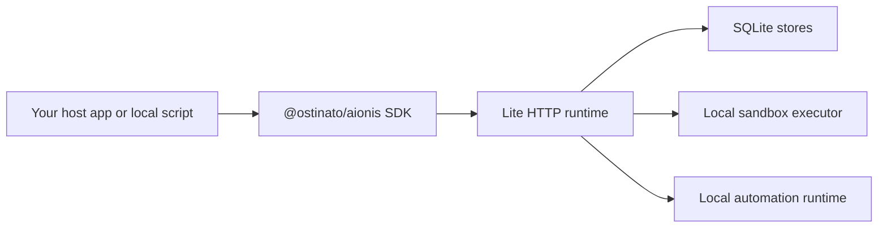

# Lite runtime

The current public runtime story is Lite.

  Runtime distribution
  
Lite is the current public runtime shape. It is local, explicit, and SQLite-backed, with one place to run task start, handoff, replay, lifecycle reuse, sandbox execution, and automation.

  

    Local shell
    SQLite stores
    Memory lifecycle
    Policy memory
    Sandbox + automation
  

Lite is a real local runtime shell with SQLite-backed persistence.

## Mental model

Think about Lite as the public, inspectable runtime distribution of Aionis.

It gives you:

1. a real local host
2. explicit supported routes
3. local persistence
4. sandbox and automation support
5. a clear runtime shape you can inspect and integrate

That is different from a toy "local demo mode". Lite is the public runtime shape.

## What Lite includes

- memory write and recall
- archive rehydrate and node activation lifecycle routes
- planning and context runtime
- policy memory materialization and governance routes
- handoff store and recover
- replay core
- governed replay subset
- local automation runtime
- local sandbox runtime

## What Lite is good for

Lite is the right shape when you want to:

- evaluate the Aionis runtime locally
- integrate the public SDK directly
- run continuity flows in development, local tooling, or local-first environments
- test task start, handoff, replay, automation, and lifecycle behavior directly

It is especially strong for coding and ops-style workflows where file targets, next actions, and execution evidence matter.

## Why Lite is a good evaluation surface

Lite brings the core continuity loop into one local runtime:

1. task start and planning
2. handoff and resume
3. replay and playbooks
4. lifecycle reuse and semantic forgetting
5. sandbox execution and automation

That makes it a strong surface for evaluation, local tooling, and local-first integration.

## A typical Lite deployment shape

In practice, a Lite deployment usually looks like this:

That means you can evaluate and integrate the runtime without needing a hosted service first.

## What to expect operationally

When Lite is healthy, you should expect:

- a reachable `/health` route
- stable local startup defaults
- local SQLite files under `.tmp/` by default
- memory, handoff, replay, automation, and sandbox surfaces available through the same host
- policy memory and evolution review visible through the same local runtime
- structured errors instead of ambiguous local failures

If you need env defaults, startup scripts, or path details, continue to [Lite Config and Operations](./lite-config-and-operations.md).

## Best reads

- [Lite Config and Operations](./lite-config-and-operations.md)
- [Automation](./automation.md)
- [Sandbox](./sandbox.md)
- [Architecture Overview](../architecture/overview.md)
- [Contracts and Routes](../reference/contracts-and-routes.md)
- [Review Runtime](../reference/review-runtime.md)
- [Policy Memory and Evolution](../reference/policy-memory.md)
- [FAQ and Troubleshooting](../faq-and-troubleshooting.md)
