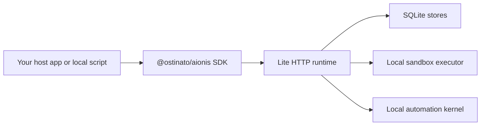

# Lite runtime

The current public runtime story is Lite.

  Runtime distribution
  
Lite is the current public runtime shape. It is local, explicit, SQLite-backed, and honest about what does not ship yet.

  

    Local shell
    SQLite stores
    Memory lifecycle
    Policy memory
    Sandbox + automation
  

Lite is a real local runtime shell with SQLite-backed persistence. It is not a hosted control plane and it does not pretend to expose every server-side surface.

## Mental model

Think about Lite as the public, inspectable runtime distribution of Aionis.

It gives you:

1. a real local host
2. explicit supported routes
3. local persistence
4. sandbox and automation support
5. honest boundaries for what does not ship yet

That is different from a toy "local demo mode". Lite is the public runtime shape.

## What Lite includes

- memory write and recall
- archive rehydrate and node activation lifecycle routes
- planning and context runtime
- policy memory materialization and governance routes
- handoff store and recover
- replay core
- governed replay subset
- local automation kernel
- local sandbox kernel

## What Lite is good for

Lite is the right shape when you want to:

- evaluate the Aionis runtime locally
- integrate the public SDK without waiting for a hosted control plane
- run continuity flows in development, internal tooling, or local-first environments
- test task start, handoff, replay, automation, and lifecycle behavior directly

It is especially strong for coding and ops-style workflows where file targets, next actions, and execution evidence matter.

## What Lite does not include

Lite intentionally excludes server-only route groups such as:

- admin control routes
- broader hosted control-plane surfaces

When a surface is intentionally outside Lite, the runtime should not blur that boundary. It either omits the route or returns a structured `501`.

## Why the `501` boundary is useful

An explicit `501` is better than a fake local surface that behaves differently from the real runtime model.

That boundary tells you:

1. this route family exists in the broader repository
2. it is not part of the public Lite promise
3. your host should not assume it is available locally

This makes Lite easier to trust as a product surface.

## Why that matters

This is one of Aionis' strengths: Lite now includes local memory lifecycle routes without pretending every broader hosted capability is already productized.

## A typical Lite deployment shape

In practice, a Lite deployment usually looks like this:

That means you can evaluate and integrate the runtime without needing a hosted service first.

## What to expect operationally

When Lite is healthy, you should expect:

- a reachable `/health` route
- stable local startup defaults
- local SQLite files under `.tmp/` by default
- memory, handoff, replay, automation, and sandbox surfaces available through the same host
- policy memory and evolution review visible through the same local runtime
- structured errors instead of ambiguous local failures

If you need env defaults, startup scripts, or path details, continue to [Lite Config and Operations](./lite-config-and-operations.md).

## Best reads

- [Lite Config and Operations](./lite-config-and-operations.md)
- [Automation](./automation.md)
- [Sandbox](./sandbox.md)
- [Architecture Overview](../architecture/overview.md)
- [Contracts and Routes](../reference/contracts-and-routes.md)
- [Review Runtime](../reference/review-runtime.md)
- [Policy Memory and Evolution](../reference/policy-memory.md)
- [FAQ and Troubleshooting](../faq-and-troubleshooting.md)
