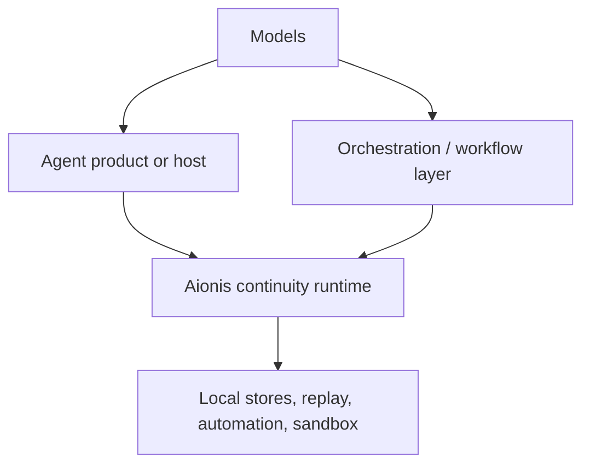

# Why Aionis

`Aionis Runtime` is useful when an agent system has to carry execution across runs instead of behaving like every task is a fresh prompt.

That is the problem space the runtime is built for.

  Why it matters
  
The strongest argument for Aionis is not "it stores memory." The argument is that continuity becomes a runtime primitive with explicit APIs, typed contracts, and a real local runtime boundary.

  

    Not transcript glue
    Explicit contracts
    Replay-driven reuse
    Honest Lite boundary
  

  

    What breaks
    <h3>Prompt glue</h3>
    
Continuity lives in transcripts, local notes, or host-specific conventions.

    <ul>
      <li>Repeated work still starts from zero.</li>
      <li>Resume quality depends on prose summaries.</li>
      <li>Successful execution is hard to reuse.</li>
    </ul>
  

  

    What Aionis does
    <h3>Continuity runtime</h3>
    
Continuity becomes explicit runtime behavior with typed routes and reusable execution state.

    <ul>
      <li>`task start` improves the next first move.</li>
      <li>`handoff` preserves runtime-readable resume state.</li>
      <li>`replay` and `automation` turn success into reuse.</li>
    </ul>
  

  Mechanism
  
Aionis is not trying to sound more intelligent than other agent products. It is trying to make execution more accumulative, more recoverable, and more reusable.

  

    Task start
    Handoff
    Replay
    Automation
    Review
  

## The short answer

Most agent products are good at producing a strong run.

Aionis is about making the next run better because the previous run happened.

That is the difference:

- not just "an agent that can work for a while"
- but a runtime that can accumulate execution memory and reuse it through task start, handoff, replay, automation, and review

## The problem behind the product

The continuity problem usually appears in one of these forms:

| Failure | What it looks like |
| --- | --- |
| Repeated-start failure | The same class of task keeps arriving, but the system still starts from zero |
| Resume failure | A paused task comes back and the next run cannot trust the previous state |
| Reuse failure | A successful run finishes, but the workflow cannot be reused in a reliable way |
| Coordination failure | One agent or operator has useful state, but the next worker cannot inherit it cleanly |

These are infrastructure failures, not just prompting failures.

## The main technical advantages

### 1. Continuity is a runtime primitive

Most agent systems treat continuity as prompt glue, saved transcripts, or host-specific state. Aionis moves that into explicit runtime surfaces:

- `task start` for repeated-task kickoff
- `handoff` for pause and resume
- `replay` for successful-run reuse

That is a stronger foundation than hoping the next prompt reconstructs the right state.

What this means in practice is that continuity is visible and programmable:

- `task start` becomes an API, not a vibe
- `handoff` becomes a recoverable packet, not a prose note
- `replay` becomes a reusable artifact, not a log line

### 2. Contracts are explicit

The public SDK and route surfaces are typed and inspectable.

That matters when you are integrating agent behavior into a real product and need something more stable than internal prompt conventions.

It also matters for long-lived systems, because you can:

- inspect which surface you are actually calling
- test route families directly
- reason about Lite support vs non-Lite support
- build host logic around typed responses instead of transcript parsing

### 3. Lite is a real runtime, not a placeholder

The public runtime story is not a conceptual API sketch. Lite runs locally today with:

- SQLite-backed persistence
- route registration
- replay support
- local automation support
- local sandbox execution

That makes the project evaluable as software, not only as architecture.

This is one of the practical strengths of Aionis: the public runtime is not only a future hosted promise. You can run it now, inspect it now, and decide whether the runtime shape fits your system.

### 4. Successful work can become reusable work

The replay subsystem is important because it pushes Aionis beyond generic storage.

The runtime is trying to turn successful execution into reusable operating knowledge through replay lifecycle, playbook promotion, and local playbook execution.

That is the "self-evolving" part of the story in concrete form:

1. execution produces evidence
2. evidence becomes memory or replay state
3. replay can become a playbook
4. automation and planning can reuse those playbooks later

### 5. The runtime boundary is deliberate

Lite does not pretend to expose every server-only or control-plane surface.

Unsupported route groups are omitted or returned as structured `501` responses. That is a strength, because it keeps the local runtime honest about what it does and does not ship.

For infrastructure, honesty matters. A fake local surface is worse than a narrow explicit one.

## Where Aionis fits in the stack

Aionis is not trying to replace:

- the model
- the chat assistant UI
- the orchestration framework
- the host application

It fits below those systems as a continuity layer.

That is why Aionis is strongest when your system already has agents, tools, or workflows and now needs continuity that survives beyond one run.

  Decision frame
  
If your main problem is raw model quality, Aionis is not the first layer you fix. If your main problem is that execution cannot survive, recover, or improve across runs, Aionis is the right layer to evaluate.

## Why this matters more than "long tasks"

Many agent products can already run long tasks. That is not enough.

The harder question is:

`What does the system keep, recover, and improve after the task ends or pauses?`

Aionis is valuable when that question matters more than raw one-shot task completion.

## Best-fit scenarios

The runtime is strongest when work is:

- repeated but not identical
- tool-heavy rather than purely conversational
- likely to pause or hand off
- valuable enough to replay or promote later

That is why coding and ops are the strongest current fit, but the runtime model is broader than coding alone.

## What this means in practice

If you are building coding-agent infrastructure, the runtime gives you a clearer substrate for:

- repeated bug-repair or review flows
- trustworthy pause and resume
- reusable playbook creation
- host integration through stable SDK calls
- local evaluation before a larger hosted design exists

The same continuity model also applies to:

- multi-agent repair loops
- internal workflow copilots
- automation paths that need approval and replay
- operational systems where the next action is more important than the last chat turn

## The adoption test

You probably need Aionis when at least two of these are true:

1. your system sees recurring task families
2. pause/resume quality is a real problem
3. handoff between workers or agents is lossy today
4. successful execution should become reusable workflow guidance
5. you want continuity to be infrastructure, not host-specific transcript glue

  evaluation
  fit
  mismatch

Evaluate Aionis like infrastructure: by fit to runtime failure modes, not by generic AI assistant expectations.

## Where to look next

1. [Architecture Overview](./architecture/overview.md)
2. [Getting Started](./getting-started.md)
3. [Lite Runtime](./runtime/lite-runtime.md)
4. [Contracts and Routes](./reference/contracts-and-routes.md)

  <a class="doc-card" href="./concepts/task-start.md">
    Value surface
    <h3>Task Start</h3>
    
See how prior execution becomes a better first move for repeated work.

  </a>
  <a class="doc-card" href="./concepts/handoff.md">
    Value surface
    <h3>Handoff</h3>
    
See how pause and resume move from prose summaries into runtime-readable state.

  </a>
  <a class="doc-card" href="./concepts/replay.md">
    Value surface
    <h3>Replay</h3>
    
See how successful execution becomes reusable playbooks instead of disappearing after one run.

  </a>

