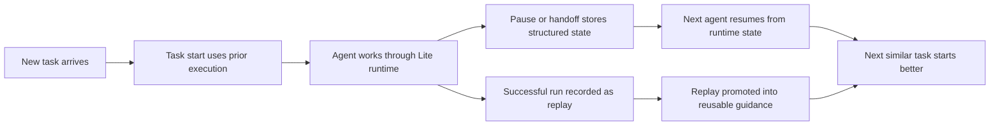

<div class="hero-install" aria-label="Install command">
  <code>npm install @ostinato/aionis</code>
</div>

<div class="trust-strip" aria-label="Project status">
  <span>Lite ships today</span>
  <span>v0.1.0</span>
  <span>MIT licensed</span>
  <span>15 / 15 benchmark scenarios</span>
</div>

<div class="home-demo">
  <span class="home-demo-caption">A real SDK slice against a local Lite runtime</span>

```ts
import { createAionisClient } from "@ostinato/aionis";

const aionis = createAionisClient({ baseUrl: "http://127.0.0.1:3001" });

const taskStart = await aionis.memory.taskStart({
  tenant_id: "default",
  scope: "docs-home",
  query_text: "fix flaky retry in worker.ts",
});

await aionis.handoff.store({
  tenant_id: "default",
  scope: "docs-home",
  anchor: "task:retry-fix",
  summary: "Pause after diagnosis",
  handoff_text: "Resume in src/worker.ts and patch retry handling.",
  target_files: ["src/worker.ts"],
  next_action: taskStart.first_action?.next_action ?? "Patch retry handling in src/worker.ts",
});

await aionis.memory.replay.run.start({
  tenant_id: "default",
  scope: "docs-home",
  actor: "docs-home",
  run_id: "retry-fix-run-1",
  goal: "fix flaky retry in worker.ts",
});
```

</div>

## What Aionis Runtime is

`Aionis Runtime` is the public runtime in this repository.
`Aionis Core` is the kernel that powers it.
`Lite` is the local runtime distribution shipping today.

The practical mental model is:

> `Aionis Runtime = a self-evolving continuity runtime for agent systems`

It provides explicit runtime surfaces for:

- learned task start for repeated work
- structured handoff and resume
- replay and playbook promotion
- local automation and sandbox execution
- typed SDK and stable route contracts

Today the runtime is strongest for coding and ops workflows, but the continuity model is broader. If an agent or multi-agent workflow needs reliable task start, trustworthy handoff, or reusable replay, Aionis is in scope.

## Why teams use it

Most agent systems break on continuity before they break on raw reasoning quality:

1. repeated tasks still start from zero
2. paused work resumes without trustworthy execution state
3. successful repairs do not become reusable operating knowledge

Aionis turns continuity into runtime infrastructure instead of leaving it inside prompts and chat transcripts.

## How continuity improves over time



The core product loop:

- execution produces evidence
- evidence becomes execution memory
- execution memory improves the next task start, handoff, and replay path

<!-- BEGIN:CORE_PATH -->

## Default Product Path

| Path | What To Prove | Primary Surfaces |
| --- | --- | --- |
| Core | Continuity works at all | `memory.write(...)`, `memory.taskStart(...)` or `memory.planningContext(...)`, `handoff.store(...)`, `memory.replay.run.*` |
| Enhanced | Continuity improves over time | `memory.archive.rehydrate(...)`, `memory.nodes.activate(...)`, `memory.reviewPacks.*`, `memory.sessions.*` |
| Advanced | The kernel exposes deeper learning and control | `memory.experienceIntelligence(...)`, `memory.executionIntrospect(...)`, `memory.delegationRecords.*`, `memory.tools.*`, `memory.rules.*`, `memory.patterns.*` |

Recommended order:

1. prove the Core path first
2. add the Enhanced path when reuse quality matters
3. move into the Advanced path only when your host needs deeper substrate controls

Fastest repository proof:

```bash
npm run example:sdk:core-path
```

<!-- END:CORE_PATH -->

## Choose your reading path

<div class="home-path-grid">
  <a class="home-path-card" href="/docs/getting-started">
    <span class="home-path-kicker">Evaluate · 5 min</span>
    <h3 class="home-path-title">Run Lite locally</h3>
    <p>Boot the runtime, hit the health route, and see the local runtime shape.</p>
  </a>
  <a class="home-path-card" href="/docs/sdk/quickstart">
    <span class="home-path-kicker">Integrate · 10 min</span>
    <h3 class="home-path-title">Use the SDK</h3>
    <p>Write memory, ask for task start, store handoff, and move into replay from TypeScript.</p>
  </a>
  <a class="home-path-card" href="/docs/architecture/overview">
    <span class="home-path-kicker">Understand · 15 min</span>
    <h3 class="home-path-title">Read the runtime shape</h3>
    <p>See how Lite splits shell, bootstrap, host, stores, and kernel instead of hiding continuity in prompts.</p>
  </a>
</div>

## What ships in Lite today

<div class="home-proof-grid">
  <div class="home-proof-card">
    <span class="home-proof-label">Public shape</span>
    <span class="home-proof-value">Lite ships now</span>
    <p>SQLite-backed runtime, typed SDK, replay, handoff, sandbox, and automation on the public path.</p>
  </div>
  <div class="home-proof-card">
    <span class="home-proof-label">Core loop</span>
    <span class="home-proof-value">start · handoff · replay</span>
    <p>The docs and runtime revolve around the same three continuity surfaces, not a vague memory story.</p>
  </div>
  <div class="home-proof-card">
    <span class="home-proof-label">Evidence</span>
    <span class="home-proof-value">15 / 15 benchmarks</span>
    <p>Benchmark reports, smoke validation, and contract tests sit behind the docs narrative.</p>
  </div>
  <div class="home-proof-card">
    <span class="home-proof-label">Developer path</span>
    <span class="home-proof-value">SDK first</span>
    <p>Start at runtime health, move into the SDK, drop into routes and architecture only when needed.</p>
  </div>
</div>

## Who should read what

| If you want to know... | Start here |
| --- | --- |
| What Aionis is and why it exists | [Introduction](/docs/intro) |
| Why continuity is the core differentiator | [Why Aionis](/docs/why-aionis) |
| How the runtime is assembled | [Architecture Overview](/docs/architecture/overview) |
| How to boot Lite and call it | [Getting Started](/docs/getting-started) |
| How to integrate from TypeScript | [SDK Quickstart](/docs/sdk/quickstart) |
| What fields and route families exist | [Contracts and Routes](/docs/reference/contracts-and-routes) |

## Start here

1. [Introduction](/docs/intro)
2. [Why Aionis](/docs/why-aionis)
3. [Architecture Overview](/docs/architecture/overview)
4. [Getting Started](/docs/getting-started)
5. [SDK Quickstart](/docs/sdk/quickstart)
6. [FAQ and Troubleshooting](/docs/faq-and-troubleshooting)
