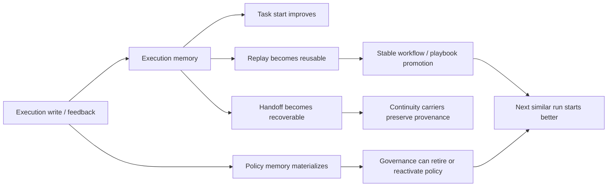
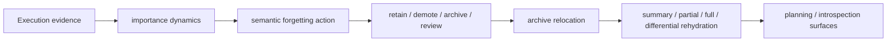
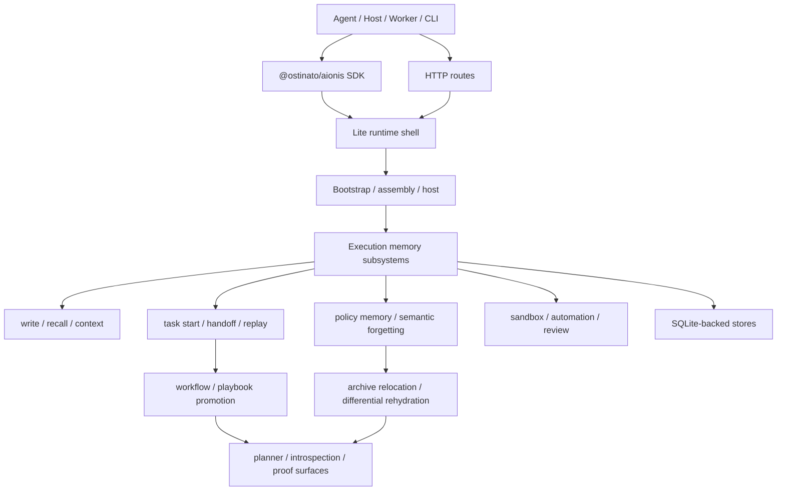

<div class="hero-install" aria-label="Install command">
  <code>npx @ostinato/aionis-runtime start</code>
</div>

<div class="trust-strip" aria-label="Project status">
  <span>Lite Developer Preview v0.4.0</span>
  <span>SDK v0.4.0</span>
  <span>Runtime package v0.2.0</span>
  <span>319 / 319 Lite tests</span>
</div>

## Positioning

Aionis Runtime turns `task start`, `handoff`, `replay`, `policy memory`, and `semantic forgetting` into one unified execution-memory loop, so agent systems do not restart from zero every time. They can continue from prior execution, improve over time, and reuse what already worked.

<div class="section-frame">
  <span class="section-label">Public product shape</span>
  <p>The public product shape today includes the standalone runtime package, Lite, the public TypeScript SDK, the local Inspector and Playground interfaces, and the docs site that explains the product, mechanisms, proof path, and route surfaces.</p>
  <div class="doc-chip-row">
    <span class="doc-chip">@ostinato/aionis-runtime</span>
    <span class="doc-chip">Lite runtime</span>
    <span class="doc-chip">@ostinato/aionis</span>
    <span class="doc-chip">Inspector / Playground</span>
    <span class="doc-chip">Docs + proofs</span>
  </div>
</div>

## Design Principles

<div class="doc-grid">
  <div class="doc-card">
    <span class="doc-kicker">Principle 1</span>
    <h3>Execution first</h3>
    <p>Aionis learns from real task starts, handoffs, replays, repairs, and governance instead of treating chat history as the product.</p>
  </div>
  <div class="doc-card">
    <span class="doc-kicker">Principle 2</span>
    <h3>Continuity first</h3>
    <p>The next start, the next resume, and the next reuse path are exposed as explicit runtime surfaces.</p>
  </div>
  <div class="doc-card">
    <span class="doc-kicker">Principle 3</span>
    <h3>Self-evolution first</h3>
    <p>Each run can strengthen the next run through better task starts, better replay, and clearer policy memory.</p>
  </div>
  <div class="doc-card">
    <span class="doc-kicker">Principle 4</span>
    <h3>Intelligent forgetting first</h3>
    <p>Memory is managed through demotion, archive, relocation, and on-demand restoration instead of growing without control.</p>
  </div>
</div>

## Core Capabilities

| Capability | What it does | Primary surface |
| --- | --- | --- |
| Task Start | Produces a stronger first action for the next similar task | `memory.taskStart(...)`, `memory.planningContext(...)` |
| Task Handoff | Stores structured recovery state across runs, including target files and next action | `handoff.store(...)`, `handoff.recover(...)` |
| Task Replay | Records successful execution, promotes stable workflows, and reuses playbooks | `memory.replay.run.*`, `memory.replay.playbooks.*` |
| Action Retrieval | Exposes the explicit next-action retrieval layer with evidence, source kind, and retrieval surfaces | `memory.actionRetrieval(...)`, `memory.experienceIntelligence(...)` |
| Uncertainty Layer | Turns weak retrieval into explicit gates such as inspect, widen recall, rehydrate payload, or request review | `memory.taskStart(...)`, `memory.planningContext(...)`, `operator_projection.action_hints[]` |
| Policy Memory | Materializes repeated successful execution into governable policy memory | `memory.tools.feedback(...)`, `memory.reviewPacks.evolution(...)` |
| Semantic Forgetting | Moves memory through retain / demote / archive / review and supports differential rehydration | `memory.archive.rehydrate(...)`, `memory.anchors.rehydratePayload(...)` |
| Session / Review / Inspect | Exposes continuity state, evolution state, and review entry points | `memory.sessions.*`, `memory.agent.*`, `memory.executionIntrospect(...)` |
| Sandbox / Automation | Executes local shell, playbook, and automation flows | Lite runtime, sandbox, automation routes |

## Action Retrieval And Uncertainty Layer

Aionis does not stop at remembering prior execution. It exposes an explicit action-retrieval layer that answers the runtime question directly: what should the agent do next, what evidence supports it, and how certain is that recommendation.

<div class="section-frame">
  <span class="section-label">What this layer now exposes</span>
  <p>The runtime can now return explicit retrieval evidence, source-kind signals, uncertainty levels, gate actions, and operator hints instead of flattening everything into one overconfident first step.</p>
  <div class="doc-chip-row">
    <span class="doc-chip">memory.actionRetrieval(...)</span>
    <span class="doc-chip">gate_action</span>
    <span class="doc-chip">widen_recall</span>
    <span class="doc-chip">rehydrate_payload</span>
    <span class="doc-chip">request_operator_review</span>
    <span class="doc-chip">operator_projection.action_hints[]</span>
  </div>
</div>

This means weak retrieval can now escalate task start instead of pretending to be a confident answer. Hosts and operators can inspect the gate surface directly and decide whether to inspect context, widen recall, or rehydrate colder payload before acting.

Read next:
[Action Retrieval](./docs/concepts/action-retrieval.md),
[Uncertainty and Gates](./docs/concepts/uncertainty-and-gates.md),
[Operator Projection and Action Hints](./docs/sdk/operator-projection-and-action-hints.md)

## Self-Evolving Mechanism



<div class="section-frame">
  <span class="section-label">What the proof path already shows</span>
  <p>The self-evolving loop is already defended by six live Lite proofs: better second task start, policy memory materialization, governance loop, continuity provenance preservation, session continuity promotion, and semantic forgetting with differential rehydration.</p>
  <div class="doc-chip-row">
    <span class="doc-chip">task-start-proof</span>
    <span class="doc-chip">policy-memory</span>
    <span class="doc-chip">policy-governance</span>
    <span class="doc-chip">continuity-provenance</span>
    <span class="doc-chip">session-continuity</span>
    <span class="doc-chip">semantic-forgetting</span>
  </div>
</div>

<div class="home-proof-section">
  <span class="home-demo-caption">Observed proof from six live Lite runs on 2026-04-18</span>
  <div class="home-proof-runbook">
    <a class="home-proof-runbook-card" href="/AionisCore/docs/evidence/proof-by-evidence">
      <span class="home-proof-runbook-label">Demo 1</span>
      <h3>Better second task start</h3>
      <p>The same task moved from a generic cold start to a learned file-aware startup.</p>
      <div class="home-proof-metric">cold: <code>tool_selection</code> → warm: <code>experience_intelligence</code></div>
      <div class="home-proof-code"><code>src/services/billing.ts</code></div>
    </a>
    <a class="home-proof-runbook-card" href="/AionisCore/docs/evidence/proof-by-evidence">
      <span class="home-proof-runbook-label">Demo 2</span>
      <h3>Policy memory materialized</h3>
      <p>Repeated positive execution feedback became persisted policy memory instead of staying as loose hints.</p>
      <div class="home-proof-metric"><code>materialization_state = "persisted"</code></div>
      <div class="home-proof-code"><code>selected_policy_memory_state = "active"</code></div>
    </a>
    <a class="home-proof-runbook-card" href="/AionisCore/docs/evidence/proof-by-evidence">
      <span class="home-proof-runbook-label">Demo 3</span>
      <h3>Governance loop proved</h3>
      <p>The runtime retired policy memory and reactivated it with fresh live evidence through the public route.</p>
      <div class="home-proof-metric"><code>active → retired → active</code></div>
      <div class="home-proof-code"><code>live_policy_selected_tool = "bash"</code></div>
    </a>
    <a class="home-proof-runbook-card" href="/AionisCore/docs/evidence/proof-by-evidence">
      <span class="home-proof-runbook-label">Demo 4</span>
      <h3>Provenance survived promotion</h3>
      <p>Stable workflow guidance kept explicit continuity provenance instead of erasing where the learning signal came from.</p>
      <div class="home-proof-metric"><code>distillation=handoff_continuity_carrier</code></div>
      <div class="home-proof-code"><code>distillation=session_event_continuity_carrier</code></div>
    </a>
    <a class="home-proof-runbook-card" href="/AionisCore/docs/evidence/proof-by-evidence">
      <span class="home-proof-runbook-label">Demo 5</span>
      <h3>Session continuity promoted a stable workflow</h3>
      <p>Repeated session state now counts as distinct workflow observations instead of depending on an event-only path.</p>
      <div class="home-proof-metric"><code>distillation=session_continuity_carrier</code></div>
      <div class="home-proof-code"><code>observed_count = 2</code></div>
    </a>
    <a class="home-proof-runbook-card" href="/AionisCore/docs/evidence/proof-by-evidence">
      <span class="home-proof-runbook-label">Demo 6</span>
      <h3>Semantic forgetting cooled memory without deleting it</h3>
      <p>Archived workflow memory now surfaces lifecycle decay, cold relocation, and differential payload restore instead of silently disappearing.</p>
      <div class="home-proof-metric"><code>semantic_forgetting.action = "archive"</code></div>
      <div class="home-proof-code"><code>rehydration_mode = "differential"</code></div>
    </a>
  </div>
</div>

## Forgetting Mechanism



<div class="section-frame">
  <span class="section-label">How forgetting works</span>
  <p>Aionis treats forgetting as lifecycle control. Memory is cooled, relocated, and restored when needed. It is not left to accumulate forever, and it is not reduced to blind deletion either.</p>
  <div class="doc-chip-row">
    <span class="doc-chip">semantic_forgetting_v1</span>
    <span class="doc-chip">archive_relocation_v1</span>
    <span class="doc-chip">archive rehydrate</span>
    <span class="doc-chip">differential rehydration</span>
  </div>
</div>

## Continuity Mechanism

<div class="doc-grid">
  <div class="doc-card">
    <span class="doc-kicker">Continuity 1</span>
    <h3>Start better</h3>
    <p>Prior execution improves the kickoff for the next similar task instead of forcing another generic first step.</p>
  </div>
  <div class="doc-card">
    <span class="doc-kicker">Continuity 2</span>
    <h3>Resume cleanly</h3>
    <p>Handoff packets store recovery anchors, target files, next actions, and resume context as runtime state.</p>
  </div>
  <div class="doc-card">
    <span class="doc-kicker">Continuity 3</span>
    <h3>Reuse successful work</h3>
    <p>Replay runs feed playbook promotion, repair review, and stable workflow reuse across later execution.</p>
  </div>
</div>

## Full Architecture



<div class="section-frame">
  <span class="section-label">Architectural stance</span>
  <p>Continuity, self-evolution, forgetting, and governance all live on explicit runtime seams. The SDK, routes, stores, sandbox, and automation path are visible and inspectable by design.</p>
</div>

## Evidence And Validation

| Metric | Current result | Entry point |
| --- | --- | --- |
| Release line | `Lite Developer Preview v0.4.0` | [What Ships Today](/docs/evidence/what-ships-today) |
| Runnable self-evolving proofs | `6` | [Proof By Evidence](/docs/evidence/proof-by-evidence) |
| Real-provider A/B snapshot | `31 / 31` vs thin · `25 / 25` vs chat · `25 / 25` vs vector | [Validation and Evidence](/docs/evidence/validation-and-benchmarks) |
| Strict replay reuse | `3 / 3`, `0` replay tokens | [Validation and Evidence](/docs/evidence/validation-and-benchmarks) |
| Lite runtime test suite | `319 / 319` | `npm run -s lite:test` |
| Public SDK test suite | `20 / 20` | `npm run -s sdk:test` |

<div class="home-proof-grid">
  <div class="home-proof-card">
    <span class="home-proof-label">Evidence</span>
    <span class="home-proof-value">6 live proofs</span>
    <p>Task start improvement, policy memory, governance, provenance, session continuity, and semantic forgetting are all defended by runnable Lite evidence.</p>
  </div>
  <div class="home-proof-card">
    <span class="home-proof-label">Validation</span>
    <span class="home-proof-value">31/31 · 25/25 · 25/25</span>
    <p>Real-provider A/B coverage remains one evidence input across repeated starts, forgetting, replay, multi-cycle refinement, and production simulation.</p>
  </div>
  <div class="home-proof-card">
    <span class="home-proof-label">SDK tests</span>
    <span class="home-proof-value">20 / 20</span>
    <p>The public SDK surface is validated directly instead of only being implied by route behavior.</p>
  </div>
  <div class="home-proof-card">
    <span class="home-proof-label">Lite tests</span>
    <span class="home-proof-value">319 / 319</span>
    <p>The current Lite runtime baseline stays green across replay, recall, handoff, policy, forgetting, and automation.</p>
  </div>
</div>

## Quick Start

### 1. Start Aionis Runtime

```bash
npx @ostinato/aionis-runtime start
```

If you are working from a source checkout instead of the published runtime package:

```bash
npm install
npm run lite:start
```

### 2. Integrate the SDK into your own project

```bash
npm install @ostinato/aionis
```

```ts
import { createAionisClient } from "@ostinato/aionis";

const aionis = createAionisClient({ baseUrl: "http://127.0.0.1:3001" });

const taskStart = await aionis.memory.taskStart({
  tenant_id: "default",
  scope: "docs-home",
  query_text: "fix flaky retry in worker.ts",
});

await aionis.handoff.store({
  tenant_id: "default",
  scope: "docs-home",
  anchor: "task:retry-fix",
  summary: "Pause after diagnosis",
  handoff_text: "Resume in src/worker.ts and patch retry handling.",
  target_files: ["src/worker.ts"],
  next_action: taskStart.first_action?.next_action ?? "Patch retry handling in src/worker.ts",
});

await aionis.memory.replay.run.start({
  tenant_id: "default",
  scope: "docs-home",
  actor: "docs-home",
  run_id: "retry-fix-run-1",
  goal: "fix flaky retry in worker.ts",
});
```

### 3. Optional: run the repository proof path

```bash
npm run example:sdk:core-path
```

<!-- BEGIN:CORE_PATH -->

## Default Product Path

| Path | What To Prove | Primary Surfaces |
| --- | --- | --- |
| Core | Continuity works at all | `memory.write(...)`, `memory.taskStart(...)` or `memory.planningContext(...)`, `handoff.store(...)`, `memory.replay.run.*` |
| Enhanced | Continuity improves over time | `memory.archive.rehydrate(...)`, `memory.nodes.activate(...)`, `memory.reviewPacks.*`, `memory.sessions.*` |
| Advanced | The runtime exposes deeper learning and control | `memory.experienceIntelligence(...)`, `memory.executionIntrospect(...)`, `memory.delegationRecords.*`, `memory.tools.*`, `memory.rules.*`, `memory.patterns.*` |

Recommended order:

1. prove the Core path first
2. add the Enhanced path when reuse quality matters
3. move into the Advanced path only when your host needs deeper substrate controls

Fastest repository proof:

```bash
npm run example:sdk:core-path
```

<!-- END:CORE_PATH -->

## Read Next

<div class="home-path-grid">
  <a class="home-path-card" href="/AionisCore/docs/getting-started">
    <span class="home-path-kicker">Evaluate · 5 min</span>
    <h3 class="home-path-title">Run Lite locally</h3>
    <p>Boot the runtime, hit the health route, and confirm the local runtime shape.</p>
  </a>
  <a class="home-path-card" href="/AionisCore/docs/sdk/quickstart">
    <span class="home-path-kicker">Integrate · 10 min</span>
    <h3 class="home-path-title">Use the SDK</h3>
    <p>Write memory, ask for task start, store handoff, and move into replay from TypeScript.</p>
  </a>
  <a class="home-path-card" href="/AionisCore/docs/architecture/overview">
    <span class="home-path-kicker">Understand · 15 min</span>
    <h3 class="home-path-title">Read the architecture</h3>
    <p>See how Lite is organized across shell, bootstrap, host, subsystems, and SQLite-backed stores.</p>
  </a>
</div>
