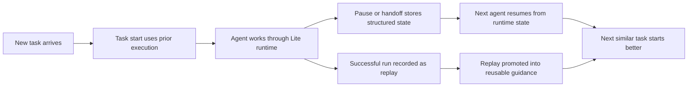

  

    Public shape
    Lite ships now
    
SQLite-backed local runtime, typed SDK, replay, handoff, sandbox, and automation are already part of the public path.

  

  

    Core loop
    Task start + handoff + replay
    
The docs and runtime both revolve around the same three continuity surfaces instead of a vague memory story.

  

  

    Evidence
    15/15 benchmark scenarios
    
The project already has benchmark reporting, smoke validation, and contract tests behind the docs narrative.

  

  

    Developer path
    SDK-first
    
You can start from local runtime health, move into the SDK, then drop into route and architecture references only when needed.

  

## What this site covers

This docs site is for understanding and using the public Aionis runtime shape.

It should answer four questions quickly:

- what Aionis Runtime is
- why it is useful
- how the runtime is structured
- how to start using it

## What Aionis Runtime is

`Aionis Runtime` is the public runtime in this repository.  
`Aionis Core` is the kernel that powers it.  
`Lite` is the current local runtime distribution of that kernel.

The practical mental model is:

`Aionis Runtime = a self-evolving continuity runtime for agent systems`

It provides explicit runtime surfaces for:

- learned task start for repeated work
- structured handoff and resume
- replay and playbook promotion
- local automation and sandbox execution
- typed SDK and stable route contracts

Today, the runtime is strongest for coding and ops workflows, but the continuity model is broader than coding alone. If an agent or multi-agent workflow needs reliable task start, trustworthy handoff, and reusable replay, Aionis is in scope.

## Why teams use it

Most agent systems break on continuity before they break on raw reasoning quality.

Typical failure modes are:

1. repeated tasks still start from zero
2. paused work resumes without trustworthy execution state
3. successful repairs do not become reusable operating knowledge

Aionis addresses those problems by turning continuity into runtime infrastructure instead of leaving it inside prompts and chat transcripts.

## What makes it different

Many agent products can already run long tasks. That is not the point of Aionis.

Aionis is about what happens across runs:

1. a task should start from prior execution, not from zero
2. a pause should recover structured runtime state, not a vague summary
3. a successful run should become reusable execution memory, not disappear into logs

That is why the public runtime is organized around `task start`, `handoff`, and `replay` instead of generic "AI memory".

## How continuity improves over time

This is the core product loop:

- execution produces evidence
- evidence becomes execution memory
- execution memory improves the next task start, handoff, and replay path

## Choose your path

  <a class="home-path-card" href="/docs/getting-started">
    Evaluate
    <h3 class="home-path-title">Run Lite locally</h3>
    
Boot the runtime, hit the health route, and see the public local runtime shape in a few minutes.

  </a>
  <a class="home-path-card" href="/docs/sdk/quickstart">
    Integrate
    <h3 class="home-path-title">Use the SDK</h3>
    
Write memory, ask for planning context, store handoff, and move into replay with the public TypeScript client.

  </a>
  <a class="home-path-card" href="/docs/architecture/overview">
    Understand
    <h3 class="home-path-title">Read the runtime shape</h3>
    
See how Lite splits runtime shell, bootstrap, host, stores, and kernel subsystems instead of hiding continuity inside prompts.

  </a>

## Architecture at a glance

The public runtime shape is organized around clear layers:

1. `apps/lite/` for the local runtime shell and launcher
2. `src/runtime-entry.ts` for bootstrap and route startup
3. `src/app/runtime-services.ts` for Lite-only assembly
4. `src/host/*` for the HTTP host and route registration
5. `src/memory/*` for replay, handoff, recall, write, and sandbox logic
6. `src/store/*` for SQLite-backed local persistence
7. `packages/full-sdk/` for the public SDK surface

See [Architecture Overview](/docs/architecture/overview) for the full runtime breakdown.

## What ships in Lite today

- SQLite-backed local persistence
- archive rehydrate and node activation lifecycle routes
- memory write, recall, and context runtime
- task handoff store and recover
- replay core and governed replay subset
- local automation kernel
- local sandbox executor
- typed SDK integration through `@ostinato/aionis`

## What this means in practice

If you run Lite locally today, you already get a real runtime shape:

- an HTTP host with explicit supported routes
- multiple SQLite stores instead of one opaque blob
- lifecycle-aware memory operations such as rehydrate and activate
- a public SDK that can call task start, handoff, replay, automation, and sandbox flows

That matters because the runtime is inspectable. You can see which surfaces exist, test them directly, and integrate them into your own host or workflow system.

## Who should read what

Use this docs site based on the question you are trying to answer:

| If you want to know... | Start here |
| --- | --- |
| What Aionis is and why it exists | [Introduction](/docs/intro) |
| Why continuity is the core differentiator | [Why Aionis](/docs/why-aionis) |
| How the runtime is assembled | [Architecture Overview](/docs/architecture/overview) |
| How to boot Lite and call it | [Getting Started](/docs/getting-started) |
| How to integrate from TypeScript | [SDK Quickstart](/docs/sdk/quickstart) |
| What fields and route families exist | [Contracts and Routes](/docs/reference/contracts-and-routes) |

## Start here

1. [Introduction](/docs/intro)
2. [Why Aionis](/docs/why-aionis)
3. [Architecture Overview](/docs/architecture/overview)
4. [Getting Started](/docs/getting-started)
5. [SDK Quickstart](/docs/sdk/quickstart)
6. [FAQ and Troubleshooting](/docs/faq-and-troubleshooting)
